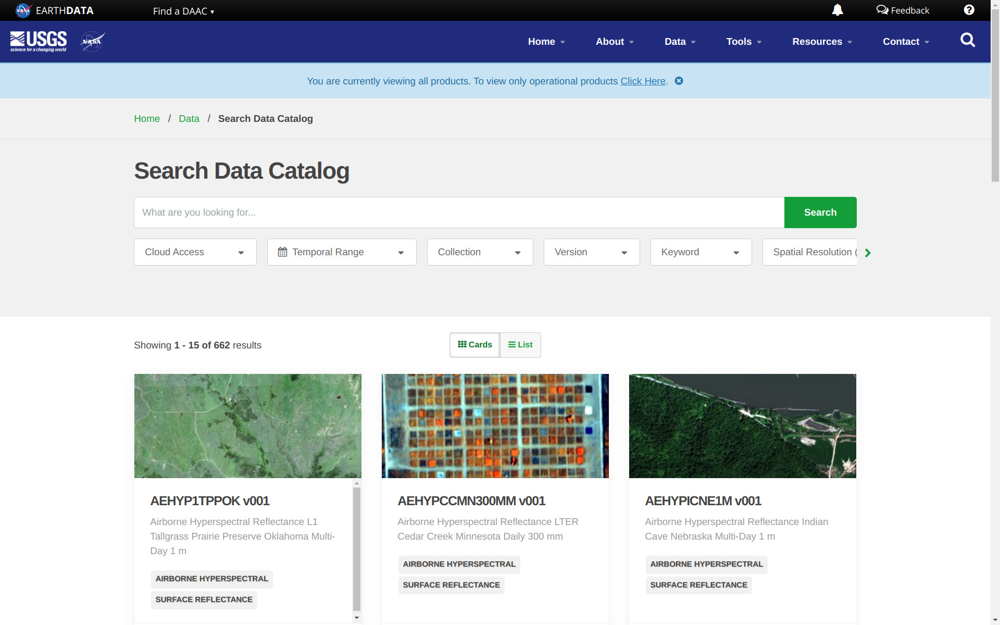
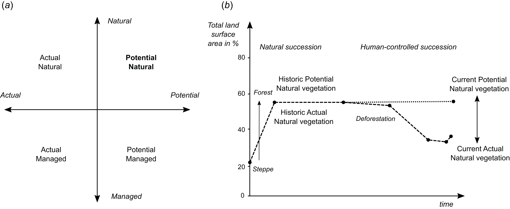

# Compendium of Global Gridded Environmental Data Sets

This is an open compendium of global (gridded) environmental datasets (bio-geophysical variables). Here you can 
find systematic listings of published data sets (a selection of the cutting-edge datasets we plan to upload to OpenLandMap.org) 
with emphasis on publicly available data sets available under open data license. These reviews are periodically 
maintained by the [www.OpenLandMap.org](https://openlandmap.org/) development team and 
collaborators. They are only meant to serve as general inventories of what is 
available, and NOT as an in-depth review article. 

To contribute to this portal, consider submitting new data by editing this Markdown document. 
Please check also the working version of the [OEMC global Land Use Land Cover Taxonomy Tables](https://docs.google.com/spreadsheets/d/1SX51OilNt-cUYpAa7t0LAvZRTzq3Sd4WJLnX6mWKfQk/edit?usp=sharing).

If your work / products are cited here you are for us **a champion of open environmental data** and 
we are enormeously thanksful for your contirbution (please never stop!).

Minimum conditions to include your contribution to this compendium:

-  Please submit / register **only global data sets** (at least 80% complete; at least 5 continents);
-  The data sets should be peer-reviewed or at least come with fully documented processing steps / metadata;
-  Refer to computational notebooks or materials that explain how was the data produced: **open science** data sets are especially encouraged; 
-  The data set should have one of the compatible **[open data licenses](https://opendefinition.org/licenses/)** or at least allow for the derivative works to be released as open data;
-  The data set should be current i.e. still in use and the citation / URL should mention the most recent update;
-  Mention of the data should focus on practical things such as _"where I can read about how was this data set produced?"_, _"where can I download this data?"_, _"what are its technical characteristics such as spatial resolution, temporal coverage, biophysical variables and measurement units?"_;

Examples of contributions that will not be welcomed:

-  Registering and submitting regional or local data sets i.e. covering only continents or countries;
-  Mentioning, listing and/or self-promoting of proprietary / commercial data sets will not be accepted;
-  Rating or criticizing data sets or expressing personal opinions;
-  Deleting text submitted by others or inserting code that is computational or difficult to maintain;

You can however mention some data sets that are not open if they are without any open data / open source alternative.

## Thematic data groups:

All layers are organized around the following themes 
(based on the [UN-GGIM The Global Fundamental Geospatial Data Themes](https://ggim.un.org/meetings/GGIM-committee/9th-Session/documents/Fundamental_Data_Publication.pdf)):

-  **Buildings and Settlements**: includes administrative and socio-economic data, natural hazards and similar,
-  **Elevation and Depth**: includes Digital Terrain Models and DEM-derived parameters, LiDAR point clouds, canopy heights, hydrological data derived from DTMs and similar,
-  **Geology and Soils**: includes geological, surface lithology and soil property and class maps,
-  **Land Cover and Land Use**: includes land cover / land use classes, land cover change and drivers of land use / land cover change, 
-  **Population Distribution**: includes population density and population variables, urbanization and lights at night images,
-  **Water**: includes surface and underground water resources and similar,
-  **Physical Infrastructure**: includes road and rail networks, dams, industrial facilities and similar,
-  **Climate**: includes long-term climatic images, climatic time-series data, future climate predictions and meteorological images,
-  **Biodiversity and Nature Conservation**: includes wildlife resources, protected areas, natural vegetation and biomes, ecoregions and biodiversity maps, 

## Other repositories of global (open) environmental layers

Sorted alphabetically:

* [Amazon AWS Open EO Data](https://registry.opendata.aws/tag/earth-observation/);
* [Atlas of the Biosphere portal](http://www.sage.wisc.edu/atlas/maps.php);
* [Copernicus Global Land Service](https://land.copernicus.eu/global/) — global data sets (bio-geophysical products) produced by the Land Monitoring Core Service (LMCS) of Copernicus, the European flagship programme on Earth Observation;
* [Earth Engine Data Catalog](https://developers.google.com/earth-engine/datasets) — Google's repository of global and local data sets;
* [EarthEnv.org](http://earthenv.org/) — Global, remote-sensing supported environmental layers for assessing status and trends in biodiversity, ecosystems, and climate (hosted by Yale University / NASA and others);
* [Environmental Information Portal](http://earthtrends.wri.org/) of the World Resources Institute contains a number of global grids derived by the WRI and collaborators;
* [ESRI ArcGIS Living Atlas of the World](https://livingatlas.arcgis.com/en/home/);
* [Euro Data Cube Public Collections](https://collections.eurodatacube.com/) — a series of global data sets primarily based on the Copernicus programme / Sentinel satellites;
* [FAO's GeoNetwork](http://www.fao.org/geonetwork/srv/en/main.home) — serves a diversity of data produced by FAO run or supported projects at a diversity of scales;
* [Free GIS data compendium](http://freegisdata.rtwilson.com/) by R.T. Wilson;
* [GeoPortal.org](http://www.geoportal.org/) — The Global Earth Observation System of Systems (GEOSS) portal implemented and operated by the European Space Agency (typically only a catalog of data sets / no or limited data is hosted);
* [Global Land and Discovery group](https://glad.geog.umd.edu/) — University of Maryland Global Land and Discovery group (GLAD) group global data sets,
* [MODIS Land products](https://modis.gsfc.nasa.gov/data/dataprod/) usually at moderate resolutions from 250-m to 1-km (also available for searching via https://lpdaac.usgs.gov/product_search/);
* [NASA Earth Observation (NEO)](https://earthobservatory.nasa.gov/global-maps) is part of the [EOS Project Science Office](http://eospso.nasa.gov/) located at NASA Goddard Space Flight Center;
* [Natural Earth Data](http://www.naturalearthdata.com/downloads/) website compiled by Nathaniel Vaughn (KELSO) and volunteers;
* [Oracle Open Data Repository (geospatial)](https://opendata.oraclecloud.com/);
* [ORNL DAAC](https://daac.ornl.gov/get_data/) The Oak Ridge National Laboratory Distributed Active Archive Center (ORNL DAAC) for Biogeochemical Dynamics is a NASA Earth Observing System Data and Information System ([EOSDIS](https://earthdata.nasa.gov/eosdis/daacs)) data center managed by the Earth Science Data and Information System ([ESDIS](https://earthdata.nasa.gov/esds)) Project;
* [Overture Maps](https://overturemaps.org/download/) by the Overture Maps Foundation serves some basic admin layers e.g. buildings, road networks, places etc all as open data.
* [SEDAC](https://sedac.ciesin.columbia.edu/data/sets/browse) — A Data Center in NASA's Earth Observing System Data and Information System (EOSDIS) — Hosted by CIESIN at Columbia University;
* [The awesome-gee-community-catalog](https://gee-community-catalog.org/) by Samapriya Roy et al.;
* [UNEP/GRID GEO DataPortal](http://geodata.grid.unep.ch/) and [UNEP/GRID-Arendal](http://maps.grida.no/region/global) — a large repository of global grids at various resolutions;
* [UNEP Data Catalog](https://datacatalog.unep.org/app/);

```{r usgs-modis, echo=FALSE, fig.cap="LP DAAC data catalog at https://lpdaac.usgs.gov/product_search/ is an example of continuosly updated and complete catalog of global environmental data (primarily based on MODIS and similar EO missions) which are available publicly without restrictions.", out.width="100%"}

```

## Buildings and Settlements

### Administrative and socio economic data

Administrative data can be used to calculate proximity-based parameters and to 
orient the users geographically. One publicly accessible global administrative 
data database is the [GADM](http://gadm.org/) database of Global Administrative Areas 
GADM. It comprises borders of countries and lower level subdivisions such as provinces 
and counties (more than 100,000 areas). Lower level administrative boundaries can 
be obtained via the [FAO's GeoNetwork server](http://www.fao.org/geonetwork/srv/en/main.home).
Even more detailed is the [FAO GAUL: Global Administrative Unit Layers](https://data.apps.fao.org/map/catalog/static/search?keyword=HiH_boundaries) which is 
available for different periods and up to the 3rd admin level, so one can potentially 
also track changes in political units (the [table](https://github.com/openlandmap/book/blob/master/tabular/GAUL_g2015_2014_1_legend.csv) `GAUL_g2015_2014_1_legend.csv` 
contains an example of cca 3500 administrative units with codes). The [geoBoundaries](http://www.geoboundaries.org/) 
is a global Database of Political Administrative Boundaries and contains a snapshot 
of political and administrative boundaries since 2017.

An important global vector dataset is the [World Vector Shoreline](https://shoreline.noaa.gov/data/datasheets/wvs.html) 
data set at scale 1:250,000 [@carlotto2017enhancing]. This can be, for example, 
used to derive the global distance from the sea coast line map and similar. 

The [Overture Maps foundation](https://overturemaps.org/download/) provides up-to-date (current) global vectors on 
Layers of interest include: admins, base, buildings, places etc. You can simply [download](https://github.com/OvertureMaps/data/) 
the data for are of interest, then convert to [PMTiles](https://msbarry.github.io/planetiler-overture-demo/) or similar, then add to back-end/front-end as a clickable layer.

The [Socioeconomic Data and Applications Center (SEDAC)](https://sedac.ciesin.columbia.edu/data/sets/browse) a Data Center in NASA's Earth 
Observing System Data and Information System (EOSDIS) Hosted by CIESIN at Columbia University 
has produced a number of open global socio-economic data sets including on themes such as: Agriculture, Climate, Conservation, 
Governance, Hazards, Health, Infrastructure, Land Use, Marine and Coastal, Population, 
Poverty, Sustainability, Urban and Water.

## Elevation and Depth

### Digital Terrain Models

Global Shuttle Radar Topography Mission (SRTM) [Digital Elevation Model](http://en.wikipedia.org/wiki/Digital_elevation_model) is 
on of the most well-known global environmental dataset [@rabus2003shuttle] 
available with a resolution of approximately 30-m (1 arcsec). The most recent 
version of the SRTM DEM is the [NASADEM](https://lpdaac.usgs.gov/products/nasadem_hgtv001/).
In 2018 two new global elevation models were produced:

- ESA's [Copernicus DEM GLO-30](https://doi.org/10.5270/ESA-c5d3d65) at 30-m resolution;
- JAXA's [ALOS AW3D30](https://www.eorc.jaxa.jp/ALOS/en/dataset/aw3d30/aw3d30_e.htm) at 30-m resolution;

Both ALOS AW3D and GLO-30 are the new generation surface models, but both need removal 
of canopy and buildings before they can be used as terrain models i.e. for surface water runoff and similar. 
@MERITDEM  has produced MERIT DEM and MERIT Hydro, actual DTM post-filtered and hydrologically 
correct DTM. Both are available for [download](https://hydro.iis.u-tokyo.ac.jp/~yamadai/MERIT_Hydro/) under open data license but only at 90/100-m resolution. Using the MERIT DEM, @amatulli2020geomorpho90m  have produced [Geomorpho90m](https://doi.org/10.5069/G91R6NPX) and 
[Hydrography90m](https://doi.org/10.18728/igb-fred-762.1) [@amatulli2022hydrography90m] data sets. 

A complete land surface model ETOPO1 Global Relief Model (includes bathymetry data) 
is available at resolution of 1-km and can be obtained from the [NOAA's National Geophysical Data Center](http://ngdc.noaa.gov/) [@amante2009etopo1]. 
An updated version of the ETOPO is the Global Land One-km Base Elevation Project ([GLOBE](http://www.ngdc.noaa.gov/mgg/topo/globe.html)) DEM. Global bathymetry data ([GEBCO data set](http://www.gebco.net/data_and_products/gridded_bathymetry_data/)) can also obtained from the British Oceanographic Data Centre.

[OpenTopography.org](https://portal.opentopography.org/dataCatalog?group=global) maintains a catalog of 
global elevation data sets including national data sets. A combination (Ensemble-DTM) of 
GLO-30, AW3D30, MERIT DEM and number of continental / national DTM's is available via [OpenLandMap.org](https://stac.openlandmap.org/dtm.bareearth_ensemble/collection.json).

@iwahashi2007automated produced a global landform type map of the world at 250-m.
Geomorphological forms (Geomorphon classification system) at 100-m are also available for download 
via the [OpenTopography.org](https://doi.org/10.5069/G91R6NPX) repository.
@Frye2023 produced **[Named Landforms of the World (NLW2)](https://www.esri.com/arcgis-blog/products/arcgis-living-atlas/announcements/introducing_nlwv2/)** with most of data at 250-m resolution.

### Canopy height data

There are several global reference point data set and products that represent canopy height (often 
including heights of building / human-built structures). Currently the two global 
public reference data sets / missions for monitoring canopy height and morphological ecosystem 
parameters are:

-  [Global Ecosystem Dynamics Investigation (GEDI) data set](https://gedi.umd.edu/);
-  [ICESat, ICESat-2 data sets](https://openaltimetry.earthdatacloud.nasa.gov/data/);

You can visually explore and download the ICESat data from https://www.openaltimetry.org. 
GEDI and ICESat can be used to derive number of ecosystem parameters including biomass 
density (above ground), canopy height, terrain height, LAI, canopy structure etc.
The complete global gridded canopy height / biomass density products include: 

- [Global forest canopy height maps at 30-m](https://glad.umd.edu/dataset/gedi/) produced by GLAD [@POTAPOV2021112165];
- [Global 10-m resolution canopy height map](https://langnico.github.io/globalcanopyheight/) [@lang2023high];
- [Global 100-m resolution aboveground biomass carbon density](https://doi.org/10.6084/m9.figshare.c.4561940) [@Spawn2020];
- [GEDI L4B](https://daac.ornl.gov/cgi-bin/dataset_lister.pl?p=40) gridded aboveground biomass density (nominal latitude extent of -52 to 52 degrees) at 1-km resolution [@Dubayah2023];

### Hydrological / hydrographic data

World river and stream networks (vector files) are available from the [Global River Classification (GLORIC) DB](https://www.hydrosheds.org/page/gloric).
A [rasterized version of this data set](https://zenodo.org/doi/10.5281/zenodo.3355006) is available at resolution of 250-m.
[MERIT Hydro](http://hydro.iis.u-tokyo.ac.jp/~yamadai/MERIT_Hydro) also provides Upstream Drainage Area at 100-m global and should be considered a reference at this scale [@MERITDEM]. 
@amatulli2022hydrography90m describes Hydrography90m (global hydrographic dataset) although this is 
not available as open data (NC-license). 

Several data set exists that quantify global surface water extent and type, wetlands distribution and 
fresh-water resources in general: 

- [JRC's global surface water dynamics images at 30-m](https://global-surface-water.appspot.com/): this includes occurrence probability of surface water, surface water extent and change 1984–2021 [@Pekel2016];
- [GLAD's global surface water dynamics 1999–2021](https://glad.umd.edu/dataset/global-surface-water-dynamics) at 30-m resolution providing also map of 7 types of surface water stable and change dynamics [@pickens2020mapping];
- [Multi-source global wetland map at 500-m resolution](https://doi.org/10.1594/PANGAEA.892657) [@tootchi2019multi]


## Geology and Soils

### Geology and lithology

The current global geological map approved by the Commission for the Geological Map of 
the World is the [1:25M Geological Map of the World](https://ccgm.org/en/) (maps not available publicly). 
The world geological maps are now being integrated via the [OneGeology](http://www.onegeology.org/) 
project which aims at producing a consistent Geological map of the world in approximate scale 1:1M [@jackson2010onegeology]; 
progress can be followed via the interactive [portal](http://portal.onegeology.org/). 

USGS has several data [portals](http://energy.usgs.gov/), e.g. that allow browsing 
of the [International Surface Geology](https://certmapper.cr.usgs.gov/data/apps/world-maps/) 
(split into South Asia, South America, Iran, Gulf of Mexico, Former Soviet Union, Europe, Carribean, Bangladesh, Asia Pacific, Artic, Arabian Peninsula, Africa and Afganistan). 
@hartmann2012new have assembled a global, purely lithological database called **GLiM** ([Global Lithological Map](https://www.geo.uni-hamburg.de/geologie/forschung/aquatische-geochemie/glim.html)). 
GLiM consists of over 1.25 million digital polygons with classified in three levels (a total of 42 rock-type classes).

USGS, jointly with ESRI, have released in 2014 a **[Global Ecological Land Units map](https://www.esri.com/about/newsroom/insider/the-first-detailed-ecological-land-unitsmap-in-the-world/)** 
at 250-m resolution. This also includes a world layer of rock types. This data can 
be downloaded from the [USGS site](http://rmgsc.cr.usgs.gov/outgoing/ecosystems/Global/) or via [Zenodo](https://zenodo.org/doi/10.5281/zenodo.1447198).

### Earthquakes / natural hazards

Natural hazards include:

* Earthquakes,
* Volcanoes,
* Landslides,
* Famines & Droughts,
* Hurricanes, Tornados, and Cyclones,
* Extreme precipitation and flooding,
* Extreme Temperature (Heat & Cold),
* Wildfires,

A number of institutions have jointly produced a [Global Seismic Hazard map](https://www.gfz-potsdam.de/gshap) [@shedlock2000gshap]. 
This map, although slightly outdated and of limited detail, can be obtained directly 
from the GSHAP project [webite](https://www.gfz-potsdam.de/gshap). From the 
[NOAA's National Geophysical Data Center](http://ngdc.noaa.gov/hazard/earthqk.shtml) one 
can obtain a point map with all major earth quakes (**Significant Earthquake Database**; cca 5000 quakes), 
and generate a (kernel density) map for Earthquake magnitude.

University of Hawaii maintains a [Global Hazards Information Network](https://www.pdc.org/risk-and-vulnerability/), 
which contains a number of global layers including a [map of Global Airports](https://hub.arcgis.com/datasets/esri-de-content::world-airports), locations of [significant earthquakes](https://earthquake.usgs.gov/earthquakes/browse/significant.php) and earthquake zones.

### Soils

Soil maps (physical, chemical, biological soil properties and soil classes) are especially important for spatial prediction of distribution 
of vegetation and (plant) species distribution. 
FAO, IIASA, ISRIC, ISSCAS, JRC have produced in 2007 a 1-km resolution gridded 
soil-class map, produced by merging various national soil maps. This product is 
also known as the **[Harmonized World Soil Database](https://www.fao.org/soils-portal/data-hub/soil-maps-and-databases/harmonized-world-soil-database-v20/en/)**. 
Global predicted WRB soil type maps at 1-km can be download as geotifs from [here](https://doi.org/10.5281/zenodo.7820796).
USGS / USDA have produced a map of [Global Soil Regions](https://www.nrcs.usda.gov/conservation-basics/natural-resource-concerns/soils/soil-geography) 
map at resolution of 60 arcsec, and which is based on the FAO-UNESCO soil map.

A list of seven gridded soil property maps (at resolution of 5 arc-minutes i.e. about 10-km) — 
soil-carbon density, total nitrogen density, field capacity, wilting point, profile 
available water capacity, thermal capacity, and bulk density — is available via the [International Geosphere-Biosphere Program Data and Information System (IGBP-DIS) data set](https://daac.ornl.gov/SOILS/guides/IGBP-DIS.html). Some additional soil property maps such as [pH](https://sage.nelson.wisc.edu/data-and-models/atlas-of-the-biosphere/mapping-the-biosphere/ecosystems/) and [soil moisture](https://sage.nelson.wisc.edu/data-and-models/atlas-of-the-biosphere/mapping-the-biosphere/ecosystems/), can 
be also obtained from the [Atlas of Biosphere project](https://sage.nelson.wisc.edu/data-and-models/atlas-of-the-biosphere/).
[Global Soil Dataset for Earth System Model (GSDE)](http://globalchange.bnu.edu.cn/research/soilw) contains the largest 
number of soil properties (gridded) at 1-km spatial resolution [@Shangguan2014].

FAO's Global Soil Partnership has produced a [Global Soil Organic Carbon Map (GSOCmap)](https://doi.org/10.4060/ca7597en) at 1-km resolution. 
ISRIC — World Soil Information maintains [a global soil profile database (WoSIS)](http://www.isric.org/wosis) 
with over 100,000 profiles and over 50 analytical and descriptive parameters [@batjes2020standardised]. Predictions of soil properties (GeoTIFFs) at spatial resolution of 
250-m or better are available from multiple sources including:

-  [SoilGrids](https://www.isric.org/explore/soilgrids) [@poggio2021soilgrids];
-  [OpenLandMap.org soil properties and classes](https://developers.google.com/earth-engine/datasets/tags/openlandmap);
-  [HiHydroSoil: Global Maps of Soil Hydraulic Properties](https://www.futurewater.eu/projects/hihydrosoil/) (available upon request or directly [via GEE](https://code.earthengine.google.com/?scriptPath=users/sat-io/awesome-gee-catalog-examples:soil-properties/HiHYDRO-SOIL-LAYERS));

[Crowther's lab](https://crowtherlab.com/maps/#/) distributes a number of soil-biology global data sets (1-km) 
including maps of soil nematodes density, bacterial biomass, fungal biomass and similar.

Some soil properties are often directly estimated from the EO data. For example the soil moisture 
[GLASS SM data set](http://glass.umd.edu/soil_moisture/) and the [gap-free global daily surface soil moisture at 1-km grid resolution](https://doi.org/10.11888/RemoteSen.tpdc.272760). 
Bare soil surface fraction and spectral bands can be also derived directly from EO data e.g. @dematte2020bare; data available via [GEE](https://gee-community-catalog.org/projects/bss/).

An in-depth review of the global soil data sets is available in @Dai2019. 
Status of the soil information in the world can be also followed via David G. Rossiter's [compendium of On-Line Soil Survey Information](https://www.isric.org/explore/soil-geographic-databases#world).

## Land Cover and Land Use

### Land cover 

Land cover maps show distribution of above-surface cover in general categories and 
are used primarily for spatial planning and modeling. Ground truth observations of 
land cover can be obtained from multiple sources e.g. the **[geo-wiki.org](http://geo-wiki.org/)** 
project [@Fritz2017], 
[FROM-GLC](http://data.ess.tsinghua.edu.cn/) [@GONG2019370]; 
the most comprehensive recent global training data sets for land cover mapping to 
date (cca [2M training points](https://doi.org/10.34911/rdnt.x4xfh3) covering from years 1984 to 2020) is provided by the 
[Global Land Cover Estimation (**GLanCE**) project](https://sites.bu.edu/measures/) project [@Stanimirova2023]. 
@Shi2023 have produced **Globe230k**: a benchmark dataset for Global Land Cover Mapping 
which includes [cca 230,000 annotated images](https://doi.org/10.5281/zenodo.8429200) with a size of 512 × 512 and a spatial resolution of 1-m. 

Land cover maps are commonly derived using semi-automated methods and remote sensing 
images as the main inputs. Global land cover / land cover change maps are today primarily derived from the Sentinel-2 
and Landsat imagery. For example, the [GlobalForestWatch.org](http://globalforestwatch.org/) 
imagery showing deforestation/reforestation were derived from the 30 m resolution Landsat 
images [@hansen2013high]. The global 
Analysis-Ready Landsat mosaics ([Landsat-ARD](https://glad.geog.umd.edu/ard/glad-landsat-ard)) 
are available for download as harmonized scenes from the University of Maryland GLAD ([Global Land and Discovery group](https://glad.geog.umd.edu/)) [@rs12030426], 
but these datasets are significant in size and hence require significant processing facilities. 

Current publicly available global land cover and/or land use maps include [@Liu2021]:

* **[GLASS-GLC](https://doi.org/10.1594/PANGAEA.913496)** is global land cover time-series 1982 to 2015 at 5-km resolution derived directly in Google Earth Engine [@Liu2020ESSD].
* **[MCD12Q1 Land Cover Type Yearly L3 Global](https://lpdaac.usgs.gov/products/mcd12q1v061/)** product available in resolution from 500-km. MODIS Land cover maps (17 land cover classes based on the [International Geosphere Biosphere Programme](http://www.igbp.net/) IGBP classification system) is a temporal dataset so that one can also derive various change indices and quantify the land cover dynamics.
* **[ESA CCI Land cover](http://www.esa-landcover-cci.org/)** is a global land cover time series from 1992 to 2020+ derived at 300-m spatial resolution from MERIS, SPOT and PROBA-V imagery. Maps can be accessed through a [viewer](http://maps.elie.ucl.ac.be/CCI/viewer/) and downloaded from the ESA website or from zenodo.org [@defourny2012land].
* **[Copernicus Global Land Cover](https://land.copernicus.eu/global/products/lc)** products at 100-m for years 2015, 2016, 2017 and 2018 and based on the PROBA-V imagery [@rs12061044]. The maps which can be downloaded directly from [zenodo.org](https://zenodo.org/communities/copernicus-land-cover/). These maps contain also predicted fractions for the main land cover classes (per pixel).
* **[GLAD Global Land Cover and Land Use Change 2000–2020 (GLCLUC2020)](https://glad.umd.edu/dataset/GLCLUC2020)** provides estimate of the land cover for the last 20+ years but also quantifies changes in forest extent and height, cropland, built-up lands, surface water, and perennial snow and ice extent [@Potapov2022].
* **[GLC FCS30D](https://zenodo.org/doi/10.5281/zenodo.8239304)** is a global 30-m annual land-cover time-series data set with 17-class system for the period 1982–2021 [@Zhang2021].

**HYDE (History database of the Global Environment)** contains historic (estimated) maps (10-km resolution) of main land use 
categories up to pre-historic times 10,000 BCE to CE 2020 [@klein2017anthropogenic]. 
HYDE includes irrigated areas, rice, intensive pasture, extensive rangelands and similar. Data can be downloaded from 
the [University of Utrecht Copernicus Land Change Lab](https://landuse.sites.uu.nl/datasets/).

A detailed Water mask of the world is available also from the [Global Surface Water Explorer](https://global-surface-water.appspot.com/) hosted by European Commission JRC 
[@Pekel2016]. A Landsat-based water 
dynamics assessment (annual maps) at 30-m is also provided by @pickens2020mapping. 

Due to the availability of the Sentinel-2 10-m resolution data, several land cover 
products are now available at very high resolution (but then only covering recent 3–5 years). These include:

* **[Google Dynamic World](https://dynamicworld.app/)** at 10-m, limited to 9 classes but constantly updated [@Brown2022];
* **[ESA World Cover](https://esa-worldcover.org/en)** at 10-m based on Sentinel-1 and Sentinel-2 data for 2020 and 2021 available from [Zenodo](https://doi.org/10.5281/zenodo.7254221);  
* **[Global canopy top height map for the year 2020](https://langnico.github.io/globalcanopyheight/)** at 10-m [@lang2023high];

Several initiatives aim at integrating multiple land cover products [@rs8121036] 
and/or running land cover classification by fusing multisource EO data [@Song2017; @Liu2021]. 

ESA's **[WorldCereal](https://esa-worldcereal.org/en)** provides access to [high resolution predictions](https://doi.org/10.5281/zenodo.7875104) (10-m) 
of winter and spring cereals, maize, active cropland, irrigation and similar for year 2021 [@essd-15-5491-2023]. 

### Biophysical indices

There are number of biophysical indices including vegetation indices 
that can be derivd from optical EO images such as MODIS, Landsat and/or Sentinel. 
This includes (note: formulas for biophysical indices for MODIS, Landsat etc might differ):

-  [Bare Soil Fraction](https://www.mdpi.com/2072-4292/13/3/474) (BSF),
-  [Enhanced Vegetation Index](https://www.usgs.gov/landsat-missions/landsat-surface-reflectance-derived-spectral-indices) (EVI),
-  [Fraction of Absorbed Photosynthetically Active Radiation](https://doi.org/10.1016/j.srs.2022.100060) (FAPAR),
-  [Leaf Area Index](https://www.usgs.gov/landsat-missions/landsat-surface-reflectance-derived-spectral-indices) (LAI),
-  [Normalized Burn Ratio](https://www.usgs.gov/landsat-missions/landsat-surface-reflectance-derived-spectral-indices) (NBR),
-  [Normalized Difference Snow Index](https://www.usgs.gov/landsat-missions/normalized-difference-snow-index) (NDSI),
-  [Normalized Difference Tillage Index](https://www.mdpi.com/2072-4292/12/16/2665) (NDTI),
-  [Normalized Difference Vegetation Index](https://www.usgs.gov/landsat-missions/landsat-surface-reflectance-derived-spectral-indices) (NDVI),
-  [Normalized Difference Water Index](https://edo.jrc.ec.europa.eu/documents/factsheets/factsheet_ndwi.pdf) (NDWI),

8-day and monthly biophysical indiced from MODIS (250-m) are available from the [MOD13Q1](https://lpdaac.usgs.gov/products/mod13q1v061/).
These, however, often come with many missing pixels due to clouds and artifacts 
and require significant post-processing to reach a [complete consistent structured product](https://medium.com/mlearning-ai/present-and-future-of-data-cubes-an-european-eo-perspective-735d3f16f7c9). 

@ma2022global produced global consistent 8-day Fraction of Absorbed Photosynthetically Active Radiation (FAPAR) 
product at 250-m spatial resolution (available for download from [Zenodo](https://zenodo.org/doi/10.5281/zenodo.6405563)). 
@xiong2023improved produced an improved global consistent and complete 8-day 250-m NDVI and EVI products 
covering 2000 to 2021 (data is available for download from [Figshare](https://doi.org/10.6084/m9.figshare.22220050)).
[Global LAnd Surface Satellite (GLASS)](http://www.glass.umd.edu/Download.html) serves a number of post-processed products 
including FAPAR and Leaf Area Index (LAI) at 250-m and also covering period 2000 to 2021.
Based on the @ma2022global, @Hacklaender2024PeerJ produced an aggregated 
complete consistent [monthly FAPAR product](https://zenodo.org/doi/10.5281/zenodo.8418441) with P25, P50 and P75 quantiles. 

Global cloud-free Landsat composites (Red, NIR, SWIR1, SWIR2) for the world for multiple periods (2000, 2014, 2018, 2022) can be obtained from [GLAD Global Forest Change](https://glad.earthengine.app/view/global-forest-change).

### Forest resources

FAO periodically (every 5 years) organizes the so called [Forest Resources Assessment](https://www.fao.org/forest-resources-assessment/en/) (FRA) — 
an international compilation of forest resource assessment (forest maps, health 
and vitality status, forest functions and policies connected with forest management). 
This assessment typically results in a comprehensive report that includes both graphical 
and [tabular data](https://fra-data.fao.org/); gridded global FRA maps are typically not available. 

The Land Processes Distributed Active Archive Center (LP DAAC) archives and distributes 
**[Global Forest Cover Change (GFCC) data product](https://lpdaac.usgs.gov/products/gfcc30fccv001/)** at 30-m resolution. 
Japan Aerospace Exploration Agency (JAXA) has also released in 2014 a global 
[25-m resolution PALSAR mosaic and forest/non-forest map (2007–2010 and 2015–2021)](https://www.eorc.jaxa.jp/ALOS/en/dataset/fnf_e.htm). This data is freely available for download via the [JAXA pages](https://www.eorc.jaxa.jp/ALOS/en/palsar_fnf/data/).

Forest resources and canopy height have been mapped by the GLAD group from the Maryland university [@POTAPOV2021112165]
The data is publicly available under open data license from: https://glad.umd.edu/dataset. 
The **[WRI's Global Forest Watch](https://www.globalforestwatch.org/map/)** service can be used to access annual tree cover maps for 2000–2022+, 
forest cover change and canopy height change [@hansen2013high]. These global forest change data is openly available and can be [downloaded](https://glad.earthengine.app/view/global-forest-change) including the Landsat cloud-free mosaics for the whole world at 30-m resolution. 
Tree cover loss can be permanent (e.g. change in land use, permanent deforestation, or natural transition i.e. [ecological succession](https://en.wikipedia.org/wiki/Ecological_succession)) or 
can be temporary i.e. effect of fires, floods, pests and similar), therefore it 
is important to consider any forest inventory data within time-frame, previous state and 
considering succession rates.

### Land use change

Land use change often comes with a special legend and should not be confused with 
land cover mapping. Some typical legend entries for land use change includes:

-  Deforestation,
-  Reforestation,
-  Urbanization,
-  Loss of wetlands,
-  Wetland degradation,
-  Water reduction (surface water change),
-  Water expansion (surface water change),
-  Desertification,
-  Crop expansion,
-  Pastureland expansion,
-  Land abandonment,

[GLAD Global Land Cover and Land Use Change 2000–2020 (GLCLUC2020)](https://glad.umd.edu/dataset/GLCLUC2020) provides estimate of the land cover for the last 20+ years at 30 m + it quantifies changes in forest extent 
and height, cropland, built-up lands, surface water, and perennial snow and ice extent [@Potapov2022]. 
This data set can be downloaded (per tile) via the [GLAD's GEE repository](https://glad.earthengine.app/view/glcluc-2000-2020).
**[WRI's Global Forest Watch](https://www.globalforestwatch.org/map/)** provides high resolution  
forest cover change at 30-m resolution. 

## Population Distribution

### Population density maps

For global modeling one of the most important global socio-economic data layers are the population density 
maps and attached socio-economic variables. The [Socioeconomic Data and Applications Center](https://sedac.ciesin.columbia.edu/) (SEDAC) distributes The [Global Population Density Grid Time Series Estimates](https://doi.org/10.7927/H47M05W2) (1970–2000), 
Global Rural-Urban Mapping Project, Version 1 ([GRUMPv1](https://doi.org/10.7927/np6p-qe61)) and **Gridded Population 
of the World, Version 4** ([GPWv4](https://doi.org/10.7927/H49C6VHW)) all at resolution of up to 1-km. These are the currently most 
detailed gridded time-series dataset with consistent population density and structure; for modeling future, 
a [Global 1-km Downscaled Population Base Year and Projection Grids Based on the SSPs](https://doi.org/10.7927/q7z9-9r69) (1990–2100) [@gao2020global] is also available. It consists of global urban, rural, and total population 
for the base year 2000, population projections at ten-year intervals for 2010–2100 
at a resolution of 1-km, and was developed for the purpose of the IPCC climate modeling framework.

Joint Research Centre (JRC) of the European Commission has produced a global 100-m 
spatial resolution product called **[Global Human Settlement (GHS) population grid multitemporal (1975-2030) layer](https://doi.org/10.2905/2FF68A52-5B5B-4A22-8F40-C41DA8332CFE)** 
[@schiavina2022ghsl]. This can be considered the most detailed global population density product to date 
and is also [available via OpenLandMap.org](https://stac.openlandmap.org/pop.count_ghs.jrc/collection.json).

Facebook (Meta) through its not-for-profit project ["Data for Good"](https://dataforgood.facebook.com/dfg/tools) is 
building a series of cutting-edge population data sets including the population density maps 
at 30-m (even separating age structure and gender). These are usually based on a combination 
of legacy population data from censuses and EO products / inventory of buildings etc 
that are then used to downscale the values to high spatial resolution [@tiecke2017mapping].
The 30-m resolution population density maps for 160+ countries and territories around the world 
are available for download from https://portal.mwater.co/.

### Lights at night images

The lights at night map contains the lights from cities, towns, and other sites 
with persistent lighting, including gas flares. Images of lights at night have shown 
to be highly correlated with industrial activity and Gross Domestic Product (GPP) [@doll2006mapping]. 
A time-series of (1-km resolution) annual global night light images (1992–2013) is available via the NOAA's 
National Geophysical Data Center [the Version 4 DMSP-OLS Nighttime Lights Time Series](https://ngdc.noaa.gov/eog/dmsp/downloadV4composites.html). 
The [harmonized nighttime light (NTL) time-series composites for 1992–2020](https://doi.org/10.6084/m9.figshare.16602224.v1) are 
available at 1-km resolution [@zhao2022global].

Currently the most detailed global Lights at night images are 
the global **VIIRS nighttime lights** (**[Annual VNL V2](https://eogdata.mines.edu/products/vnl/#annual_v2)**) 
covering 2012–2020 at 500-m spatial resolution [@elvidge2021annual]. 
The Annual VNL V2 contains average, average-masked, mean, minimum and maximum values of nighttime lights.
The [lights at night images on OpenLandMap.org](https://stac.openlandmap.org/nightlights.average_viirs.v21/collection.json?.language=en) are based on time-extrapolated values so that they cover 2000–2022 
and are hence compatible with other global land products.

## Water resources

### Global Surface Water dynamics

Global surface water dynamics can be followed from three global data sets:

-  [Global Surface Water Explorer](https://global-surface-water.appspot.com/) 1985 to 2018 hosted by European Commission JRC 
[@Pekel2016];
-  [Landsat-based water dynamics](https://glad.umd.edu/dataset/global-surface-water-dynamics) at 30-m for 1999 to 2018 period by @pickens2020mapping.
-  [GLC FCS30D](https://zenodo.org/doi/10.5281/zenodo.8239304) a global 30-m annual land-cover time-series data set with 17-class system (includes ocean and fresh-water) for the period 1982–2021 [@Zhang2021].

A [MODIS-based water mask](https://lpdaac.usgs.gov/products/mod44wv006/) product at somewhat coarser resolution (250-m) is also available.
MODIS distributes a number of global products for global oceans including **[sea surface temperature (SST)](https://doi.org/10.5067/MODAM-8D9N9)** 
at 4-km resolution (daily, 8-day, monthly or annual) and similar.

**[World Ocean Database](https://www.ncei.noaa.gov/products/world-ocean-database)** (world's largest collection of uniformly formatted, quality controlled, publicly available ocean profile data) is distributed by NOAA. 
The data set covers 1990 to 2021 period.

## Physical Infrastructure

### Urbanization / human-induced changes

Quantification of urbanization and human impact is usually modeled by using population density maps, lights at night 
images and/or data on buildings. Partners in the [GLOBIO consortium](https://www.globio.info/resources) created a World Map 
of **Human Impacts on the Biosphere** for various time periods. This is basically 
a map showing a current status of the roads, railways and settlement density. 
Human impact maps can be also browsed via the [UNEP Grid Arendal](http://grida.no/). 
@weiss2018global and @weiss_global_2020 have produced [a global map of accessibility and optimal travel time to healthcare](https://data.malariaatlas.org/maps). 

The International Biosphere-Geosphere Programme, the Stockholm Environment Institute, 
the Stockholm Resilience Center, the CSIRO in Australia and the International Human 
Dimensions Programme on Global Environmental Change are producing an outreach project 
on the Anthropocene and planetary boundaries named ["Globaia"](https://globaia.org/). 

@Theobald2020 provides a [global time-series data set](https://zenodo.org/doi/10.5281/zenodo.3963012) on "Global human modification" for 1990, 2000, 2010, 2015, and 2017 and at 300 m spatial resolution. 
The Wildlife Conservation Society is hosting **Human Impact Index** (HII) and **Human Footprint** maps that can be directly [downloaded](https://wcshumanfootprint.org/data-access) [@sanderson2022march].

The Copernicus Sentinel-5P has produced number of [monthly products](https://maps.s5p-pal.com/cases/) at 2-km that can be 
used to quantify and monitor (industrial, traffic) emissions of NOx, CO/methane and SO2. 
The gap-filled monthly values of [NOx](https://doi.org/10.5281/zenodo.7464099) and [methane](https://zenodo.org/doi/10.5281/zenodo.10265072) emissions are available in OpenLandMap.org. 

A comprehensive global assessment of the human impacts to marine ecosystems can 
be followed via the work of the [National Center for Ecological Analysis and Synthesis](http://www.nceas.ucsb.edu/) in Santa Barbara. 
This group have produced [a Global Map of Human Impacts to Marine Ecosystems](http://www.nceas.ucsb.edu/globalmarine) by 
using a number of connected input GIS layers [@Halpern2008], which are available 
for [download](https://doi.org/10.5063/F1S180FS). Distribution of global airports 
and flight routes can be freely accessed from the [openflights.org](https://github.com/jpatokal/openflights). 
Chris Harrison produced the [world map](http://www.chrisharrison.net/projects/InternetMap/) of 
internet connectivity and traffic.

[Climate TRACE](https://climatetrace.org/data) provides an inventory of major source of greenhouse gas (GHG) emissions 
around the world and provides independently produced estimates of how much each emits. 
These data is available publicly, but requires pre-processing as it is a combination of 
point and polygon sources.

### Intact forest landscapes

An important global forest landscape coverage / wildlife datasets is [the world map of intact forest landscapes (IFL)](http://www.intactforests.org/) (areas hardly touched by mankind) 
at scale 1:1,000,000 (includes four classes of intact forests: 1. intact closed forests; 
2. intact open forests, 3. woodlands and savannas, closed forests; and 4. open forests, woodlands and savannas).
IFL is maintained by the Greenpeace organization [@potapov2008mapping] and is available for years 2000, 2013, 2016, and 2020. 
Another similar data set is the [World Wilderness Areas](http://geodata.grid.unep.ch/) 
and which is distributed via the UNEP GEO Data Portal [@mccloskey1989reconnaissance].

The Global Generalized [Original and Current Forest Cover dataset](https://resources.unep-wcmc.org/products/e56277812f854e7ca8fa9282ee323c5e) (V 3.0; polygon map) produced by UNEP-WCMC 
shows where were forest in past (assumed) and can be used to quantify deforestation at 
global scale.

## Climate

### Climatic datasets

[Copernicus](https://climate.copernicus.eu/climate-datasets) makes a difference between three groups of climatic data sets:

-  Station / point data sets;
-  Gridded data sets derived from modeling / reanalysis (current and past climate);
-  Projected gridded predictions / seasonal forecasting of future climate;

Key climatic variables of interest are usually:

-  minimum temperature (°C),
-  maximum temperature (°C),
-  average temperature (°C),
-  precipitation (mm),
-  solar radiation (kJ m-2 day-1),
-  wind speed (m s-1),
-  water vapor pressure (kPa),
-  probability of occurrence of snow,
-  snow thickness,
-  soil moisture,
-  water vapor (cm liquid water),

The key public gridded global climatic data sets (current and past climate) include: 

-  **[CHELSA Climate](https://chelsa-climate.org/)** with multiple long term, monthly and even daily global products at 1-km [@karger2019climatologies];
-  **[WorldClim](https://www.worldclim.org/) with monthly historic and projected climatic data at 1-km spatial resolution [@Fick2017WorldClim]**;
-  **[TerraClimate](http://doi.org/10.7923/G43J3B0R)** gridded monthly temperature, precipitation, and other water balance variables at 4-km spatial resolution [@abatzoglou2018terraclimate];
-  **[NASA's NEO](https://earthobservatory.nasa.gov/global-maps)** global climatic monthly images at 10-km covering 2000–2022+ or finer;
-  **[Copernicus ERA5](https://doi.org/10.24381/cds.adbb2d47)** available from 1940 providing hourly data on many atmospheric, land-surface and sea-state parameters together with estimates of uncertainty but at a coarse spatial resolution of cca 25-km;

In addition to basic climatic variables, WorldClim and CHELSA Climate also provide **BioClimatic 
variables** at 1-km spatial resolution e.g. frost change frequency (fcf), snow cover days (scd), potential net primary productivity (npp), growing degree days (gdd), growing season characteristics and similar [@brun2022global].
From the sources listed above, **CHELSA Climate** is possibly the most comprehensive most 
up-to-date repository with global 1-km data and even includes daily global 1km products ([CHELSA-W5E5](https://doi.org/10.48364/ISIMIP.836809.1)), 
e.g. [daily precipitation images](http://www.earthenv.org/precipitation) [@karger2021global].

More detailed climatic images can be obtained via the [Global Energy and Water Cycle Experiment project](http://www.gewex.org/datasets.html) and the [British Atmospheric Data Centre](http://badc.nerc.ac.uk/browse/badc/) (BADC). The National Center for Atmospheric Research maintains a [ClimateDataGuide](https://climatedataguide.ucar.edu/) portal. 
The National Geophysical Data Centre (NGDC) provides [free access](https://www.ncei.noaa.gov/products) 
to numerous remote sensing based global maps — from solar parameters to cloud imagery, 
energetic particle measurements and similar (collectively called “Climate monitoring” products).
[The National Snow and Ice Data Center](http://nsidc.org/data/easytouse.html) maintains 
a number of global data sets — frozen ground maps, monthly satellite-derived snow water 
equivalent (SWE) climatologies and similar. These data can be obtained for northern 
and southern hemisphere at resolution of 25-km.

@cui20211 have produced 1-km resolution maps of present-time and future Koppen-Geiger climate 
classification zones and bioclimatic variables, available for download from http://glass.umd.edu/KGClim. 

There are multiple daily and monthly global soil moisture products either purely based 
on EO images or a combination of downscaling and modeling. 
@Fang2022 produced 1-km soil moisture data set covering years 2015 to 2020 by downscaling the SMAP product.
National Snow and Ice Data Center has also produced SMAP-Derived 1-km Downscaled Surface Soil Moisture Product. 
This data set is available for download from https://nsidc.org/data/nsidc-0779/versions/1.
@han2023global produced a global daily soil moisture data set at 1-km 
resolution called **GSSM1-km** covering period 2000–2020.
The GSSM1-km dataset can be downloaded from [Figshare](https://doi.org/10.6084/m9.figshare.21806457.v1). 
@Zhang2023 used ensemble learning to produce a daily 1-km spatiotemporally continuous soil moisture product for 2000–2020 called **GLASS SM**. 
The GLASS SM is freely available at http://glass.umd.edu/soil_moisture/; the annual average global soil moisture dataset at 1-km resolution was also generated, which can be downloaded from [zenodo](https://doi.org/10.5281/zenodo.7172664).
@zheng202321 produced a gap-free global daily surface soil moisture at 1-km grid resolution 
for 2000–2020, which is available for download from the [National Tibetan Plateau/Third Pole Environment Data Center](https://doi.org/10.11888/RemoteSen.tpdc.272760) (almost 1TB of data).  
Coarser resolution (10-km or coarser) soil moisture global images are also 
available such as the [ESA's CCI soil moisture product](https://climate.esa.int/en/projects/soil-moisture/data/), 
[SMAP Enhanced L3 Radiometer Global Daily 9 km EASE-Grid Soil Moisture](https://nsidc.org/data/spl3smp_e/versions/3) and 
the [ASCAT](https://hsaf.meteoam.it/Products/ProductsList?type=soil_moisture) **Soil Wetness Profile Index** and **Root Zone Soil Moisture Profile Index**.  

[OpenLandMap.org](https://stac.openlandmap.org/wv_mcd19a2v061.seasconv/collection.json) provides access to number of original climatic data sets produced at OpenGeoHub including:

-  [Long-term MODIS Land Surface Temperature (LST) monthly daytime and nightime](https://zenodo.org/doi/10.5281/zenodo.1420114) images at 1-km resolution for 2000–2022;
-  [Global monthly water vapor at 1-km resolution](https://zenodo.org/doi/10.5281/zenodo.8193740) for 2000–2022 based on [MCD19A2](https://ladsweb.modaps.eosdis.nasa.gov/missions-and-measurements/products/MCD19A2);
-  [Global MODIS-based snow cover monthly long-term at 500-km resolution](https://zenodo.org/doi/10.5281/zenodo.5774953) for 2000–2012;
-  [SM2RAIN global precipitation daily and monthly](https://zenodo.org/doi/10.5281/zenodo.2615278) at 10-km resolution;

### Meteorological images

A number of [MODIS atmospheric / terrestrial products](https://modis.gsfc.nasa.gov/data/dataprod/) 
are available with daily updates (usually at 1-km spatial resolution) including:

-  [Daily daytime and nightime Land Surface Temperature (LST)](https://modis.gsfc.nasa.gov/data/dataprod/mod11.php);
-  [Daily cloud products](https://modis.gsfc.nasa.gov/data/dataprod/mod06.php) such as cloud thickness and temperatures [@platnick2003modis];
-  [Daily Total Precipitable Water / water vapor](https://modis.gsfc.nasa.gov/data/dataprod/mod05.php) [@gao2003water];

MODIS produces [daily estimates of the global Land Surface Temperature](https://lpdaac.usgs.gov/products/mod11a1v061/), 
which are supposedly highly accurate with an average accuracy of ±1 degree Kelvin [@Wan2004]. 

The [Meteosat](http://www.eumetsat.int/) Second Generation (MSG) satellites 
(from Meteosat-8 onwards) produce SEVIRI 15–minutes images at resolution of 1-km. 
The most interesting SEVIRI data set for environmental applications is the High Rate SEVIRI, 
which consists of 12 spectral channels including: visible and near infrared light, 
water vapor band, carbon dioxide and ozone bands. Meteosat LST products are available 
from the [Copernicus Global Land Service](https://land.copernicus.eu/global/products/lst). 

[LSTM (Land Surface Temperature Monitoring)](https://www.eoportal.org/satellite-missions/lstm) is an ESA mission developed by Airbus 
Defense and Space, set to start in 2028. The satellite will have Thermal Infrared (TIR) 
observation capabilities at high spatial resolution (30–50-m) over land and coastal 
regions in support of agriculture management services, and possibly a range of additional services.

## Biodiversity and Nature Conservation

### World ecosystems / biomes / ecoregions

Numerous global data products have been produced to show either boundaries of natural 
ecosystems also referred to as [ecoregions](https://en.wikipedia.org/wiki/Ecoregion) or biomes.
Ecoregions are terrestrial, freshwater and/or marine areas with characteristic 
combinations of soil and landform that characterize that region.
Leading providers of the global maps on biodiversity and nature conservation include:

-  [TNC's Atlas of global conservation](https://databasin.org/galleries/2d2d35ae3bc34399976b598ed7893254/);
-  [UNEP's World Atlas of Biodiversity (book)](https://resources.unep-wcmc.org/products/WCMC_RT103);
-  [Nature Map Earth project](https://explorer.naturemap.earth/);

The World Wildlife Fund has produced the global (polygon) map of **[Terrestrial ecoregions](https://databasin.org/datasets/)**,
which shows some 867 distinct eco-units, including the relative richness of terrestrial 
species by ecoregion [@olson2001terrestrial]. Another similar data set is the 
**[Freshwater Ecoregions of the World](https://databasin.org/datasets/)** [@abell2008freshwater].

USGS distributes a ["World Ecological Land Units"](https://doi.org/10.5066/P9WRNPTN) with 3,923 terrestrial ecological land units (ELUs) 
at a base resolution of 250 meters and available for [download from the USGS Global Ecosystems Data](https://rmgsc.cr.usgs.gov/outgoing/ecosystems/Global/) repository.
@sayre2019new also produced a 30 meter resolution **global shoreline vector and associated global islands database** 
for the development of standardized ecological coastal units.

FAO and IIASA maintain also a global map of **[Global Agro-Ecological Zones (GAEZ)](https://gaez.fao.org/)**. 
GAEZ classification, soil suitability, terrain slopes and land cover are provided at 1-km spatial resolution. 
The [GAEZ data viewer](https://gaez.fao.org/pages/data-viewer) provides easy access to all data layers.

@Jung2020 have produced a **[global map of terrestrial habitat types](https://zenodo.org/doi/10.5281/zenodo.3666245)** at 1-km spatial resolution. 
This is based on the International Union for Conservation of Nature (IUCN) [habitat classification scheme](https://www.iucnredlist.org/resources/habitat-classification-scheme).

The ESA's CCI **[Global Plant Functional Types (PFT)](https://doi.org/10.5285/26a0f46c95ee4c29b5c650b129aab788)** data provides yearly data 
for the time period from 1992 to 2020. PTF global dataset has 14 layers, each describing 
the percentage cover (0–100%) of a plant functional type at a spatial resolution of 300-m: 
broadleaved evergreen trees, broadleaved deciduous trees, needleleaved evergreen trees, 
needleleaved deciduous trees, broadleaved evergreen shrubs, broadleaved deciduous shrubs, 
needleleaved evergreen shrubs, needleleaved deciduous shrubs, natural grasses, 
herbaceous cropland (i.e., managed grasses), built, water, bare areas, and snow and ice.

### Potential Natural Vegetation maps

Potential Natural Vegetation (PNV) is the hypothetical vegetation cover that would be present if the vegetation 
were in equilibrium with environmental controls, including climatic factors and disturbance, 
and not subject to human management. When considering PNV, one needs to distinguish 
between potential _natural_ and potential _managed_ vegetation, and _actual_ natural 
and _actual_ managed vegetation [@hengl2018global]. 

```{r scheme-pnv, echo=FALSE, fig.cap="Schematic explanation of differences between (A) potential and actual natural/managed vegetation, and (B) current and historic vegetation in the context of global land area. Image source: https://doi.org/10.7717/peerj.5457.", out.width="100%"}

```

@griscom2017natural produced the [Global Reforestation Potential Map](https://zenodo.org/record/883444) at 1-km resolution. 
@bastin2019global produced [Potential forest cover map](https://crowtherlab.com/maps/) at 1-km resolution assuming no humans present. 
[Potential distribution of land cover classes](https://zenodo.org/doi/10.5281/zenodo.3631253) at 250-m spatial resolution based 
on the UN FAO Land Cover Classification System (LCCS) is part of the 
[NatureMap project](https://naturemap.earth/). @bonannella2023biomes provides an updated 
predictions of the potential distribution of **[global biomes](https://zenodo.org/doi/10.5281/zenodo.7520813)** at 1-km including for the future climate scenarios (2040, 2060 and beyond).

### Species distribution and biodiversity maps

**Global Biodiversity Information Facility** ([GBIF](http://data.gbif.org/)) provides access to global data showing the distribution of 
all flora and fauna species. The density maps are available only at resolution of 
1 arcdegree (about 100 km). Global maps of biodiversity measures for various groups 
of taxa (e.g. vascular plants, birds and mammals) can be browsed using the [Global Ecosystem Atlas](https://earthobservations.org/solutions/incubators/global-ecosystems-atlas). 
Similar type of maps can be browsed via the [UNEP's World Conservation Monitoring Centre](http://www.unep-wcmc.org/). 

A shape file showing location of hotspot regions is distributed by the [Conservation International](http://www.biodiversityhotspots.org/). 
@Kreft2007 produced a global map of plant species diversity (number of plant species) by using 
field records from 1,032 locations (maps are available only in coarse resolution of 120-km).
[BirdLife International](https://datazone.birdlife.org/home) publishes a number of global maps 
indicating “[Endemic and Important Bird Areas](https://datazone.birdlife.org/site/requestgis)” (IBAs and EBAs).

@pimm2014biodiversity produced maps of [species richness](https://biodiversitymapping.org/) and for 
mammals, birds, amphibians and other taxa at 10-km spatial resolution. 
[EarthMap project](https://explorer.naturemap.earth/) produced a species richness (number of species per grid cell) maps 
for amphibians, birds, mammals, reptiles and a representative set of plant taxa whose 
distribution overlaps in each 10-km cell.

@sabatini2022global produced a number of [global biodiversity maps](https://doi.org/10.25829/idiv.3506-p4c0mo) 
including the map of plant species richness at 1-km spatial resolutions. These maps are based using [sPlot database](http://www.idiv.de/splot) 
(whichs is available upon request by submitting a project proposal to sPlot’s Steering Committee).

### Protected areas

National and international protected sites and attributes can be downloaded 
(ESRI Shapefiles; after registering on the website) via the **[World Database On Protected Areas](http://protectedplanet.net/)**. 
International Union for Conservation of Nature and Natural Resources (IUCN) has 
released a Red List of Threatened Species that contains assessments for +130,000 species. 
Distribution maps (presence) for these species (with limited coverage) can be downloaded from the [IUCN website](https://www.iucnredlist.org/resources/spatial-data-download).
