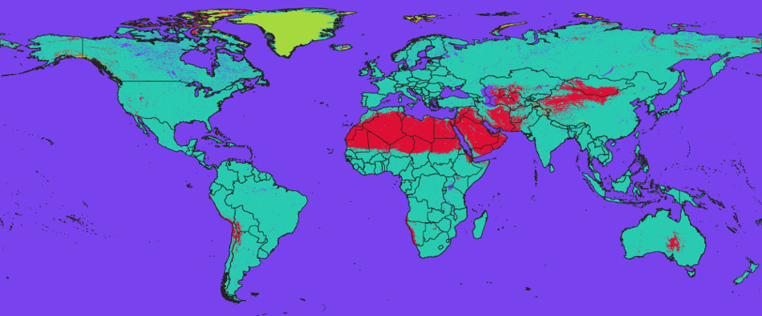

# About 

[{.cover width="250"}](https://openlandmap.org/)

[](https://doi.org/10.5281/zenodo.1476464)

## OpenLandMap project 


[OpenLandMap](https://openlandmap.org) are Open Land Data services providing access to spatial layers 
covering global land mass (at spatial resolutions of 1 km, 250 m or finer) hosted by the OpenGeoHub foundation, GILAB.rs and collaborators. 
It aims at becoming an [OpenStreetMap-type system for land data](https://towardsdatascience.com/everybody-has-a-right-to-know-whats-happening-with-the-planet-towards-a-global-commons-5a1ad4ba0bdd). Access to spatial layers is 
possible via interactive visualizations and/or Open Source software solutions. 
Read more about this project [here](https://opengeohub.org/about-openlandmap/).


The OpenLandMap layers, if not specified otherwise, are licensed under the 
[Creative Commons Attribution-ShareAlike 4.0 International license](https://creativecommons.org/licenses/by-sa/4.0/legalcode) (CC BY-SA) and/or
the [Open Data Commons Open Database License](https://opendatacommons.org/licenses/odbl/) (ODbL). This implies that anyone can use, 
or build upon, the OpenLandMap data without restrictions.
See the [Copyright and License](https://opengeohub.org/about-openlandmap/) page for more details.

<div class="figure" style="text-align: center">

<p class="caption">(\#fig:olm-istria)Example of 3D soil information: soil pH visualized at different depths.</p>
</div>

Users can access OpenLandMap data via the five main channels:

- **OpenLandMap App** at https://openlandmap.org,
- **OpenLandMap training points** at https://gitlab.com/openlandmap/compiled-ess-point-data-sets,
- **OpenGeoHub STAC** installation at https://stac.opengeohub.org,
- **OpenLandMap REST API services** at https://api.openlandmap.org,
- **OpenLandMap Wasabi service** see detailed tutorial,
- [Zenodo.org](https://zenodo.org/search?page=1&size=20&q=OpenLandMap) to access a (version-controlled) back-up copy of data via a DOI,

Data portal https://openlandmap.org is the landing page (running on Geoserver + OpenLayers) where users can browse maps, query values by
location, and find out about most recent news and activities. STAC at https://stac.opengeohub.org 
is a generic layer repository for accessing layers installed and maintained by OpenGeoHub. 
It allow users i.e. producers of layers to edit and update metadata and descriptions, 
create map views, learn how to use WCS, WMS or similar. A copy of the raw data can be obtained 
via zenodo.org or similar public data repositories.

The [training data repository](https://gitlab.com/openlandmap/compiled-ess-point-data-sets) contains 
import and processing steps run to clean up and standardize global compilations of training 
points, most importantly the land cover, vegetation, meteo, soil and ecological observations.

## Accessing data 

OpenLandMap data can be best accessed using the OpenLandMap Wasabi file service. 
This service is based on [Cloud-Optimized GeoTIFFs](https://www.cogeo.org/) and is 
probably also the best solution for doing spatial queries and spatial analysis. The Wasabi 
service is explained in detail in this **[COG tutorial](./tutorial/OpenLandMap_COG_tutorial.md)**.

### OpenLandMap REST API 

OpenLandMap data services **REST API** (https://api.openlandmap.org) contains scripts and functions 
that allow users to and developers to fetch raw data (point queries) in some simple textual 
formats such as GeoJSON, csv, compressed GeoTIFFs or similar. The following query would fetch monthly precipitations at a location X, Y: 

```
https://api.openlandmap.org/query/point?lat=7.58033&lon=35.6561&coll=layers1km&regex=clm_precipitation_imerge.(jan|feb|mar|apr|may|jun|jul|aug|sep|oct|nov|dec)_m_1km_s0..0cm_.*_v0.1.tif
```

which results in:

```
Project description	
0	"https://opengeohub.org/about-openlandmap/"
Description of all codes	
0	"https://gitlab.com/openlandmap"
response	
0	
lon	35.6561
lat	7.5803
clm_precipitation_imerge.apr_m_1km_s0..0cm_2014..2018_v0.1.tif	149
clm_precipitation_imerge.aug_m_1km_s0..0cm_2014..2018_v0.1.tif	194
clm_precipitation_imerge.dec_m_1km_s0..0cm_2014..2018_v0.1.tif	48
clm_precipitation_imerge.feb_m_1km_s0..0cm_2014..2018_v0.1.tif	51
clm_precipitation_imerge.jan_m_1km_s0..0cm_2014..2018_v0.1.tif	56
clm_precipitation_imerge.jul_m_1km_s0..0cm_2014..2018_v0.1.tif	184
clm_precipitation_imerge.jun_m_1km_s0..0cm_2014..2018_v0.1.tif	198
clm_precipitation_imerge.mar_m_1km_s0..0cm_2014..2018_v0.1.tif	109
clm_precipitation_imerge.may_m_1km_s0..0cm_2014..2018_v0.1.tif	203
clm_precipitation_imerge.nov_m_1km_s0..0cm_2014..2018_v0.1.tif	81
clm_precipitation_imerge.oct_m_1km_s0..0cm_2014..2018_v0.1.tif	152
clm_precipitation_imerge.sep_m_1km_s0..0cm_2014..2018_v0.1.tif	197
```

to determine a soil type (USDA great group) use:

```
https://api.openlandmap.org/query/point?lat=30.2543&lon=-95.5811&coll=predicted250m&regex=sol_grtgroup_usda.soiltax_c_250m_b0..0cm_1950..2017_v0.1.tif
```

which gives e.g.:

```	
Project description	
0	"https://opengeohub.org/about-openlandmap/"
Description of all codes	
0	"https://gitlab.com/openlandmap/global-layers"
response	
0	
lon	-95.5811
lat	30.2543
sol_grtgroup_usda.soiltax_c_250m_s0..0cm_1950..2017_v0.1.tif	30
info	
0	
X	30
Number	30
Group	"paleudalfs"
Great_Group_2015_match	"Paleudalfs"
Suborder	"Udalfs"
Order	"Alfisols"
```

To list all available layers use: https://api.openlandmap.org/query/populate

To query values for multiple points (currently limited to **max 50 points**) 
provide a GeoJSON with point feature collection and layer name from the table:

```	
curl -X POST --form "points=@test_points.geojson" --form "layer=pnv_fapar_proba.v.jul_d_1km_s0..0cm_2014..2017_v0.1.tif" https://api.openlandmap.org/query/points -o results.json 
```

where `test_points.geojson` is the GeoJSON file containing coordinates of points. 
More examples of how to construct spatial queries are available at: 
https://api.openlandmap.org

In addition to the REST access, you can access the OpenLandMap data using the 
[Wasabi file service](https://gitlab.com/openlandmap/global-layers/-/blob/master/tutorial/OpenLandMap_COG_tutorial.md). We recommend using the Wasabi file service only to overlay, download parts of data. 
For downloading whole GeoTIFFs we recommend instead using Zenodo.


### Accessing data from Zenodo 

To download whole layers from zenodo you can use the R packages jsonlite and RCurl:


```r
library(jsonlite)
library(RCurl)
library(rgdal)
```

You first need to authenticate yourself by using a Zenodo API TOKEN 
(see: [how to obtain API TOKEN](http://developers.zenodo.org/#quickstart-upload)):


```r
TOKEN = scan("~/TOKEN_ACCESS", what="character")
```

To download the [MODIS LST images at 1 km](https://doi.org/10.5281/zenodo.1420114) you can use the bucket ID `dep.id = "1435938"` which gives:


```r
dep.id = "1435938"
x = fromJSON(system(paste0('curl -H \"Accept: application/json\" -H \"Authorization: Bearer ', 
        TOKEN, '\" \"https://www.zenodo.org/api/deposit/depositions/', dep.id, '\"'), intern=TRUE))
  % Total    % Received % Xferd  Average Speed   Time    Time     Time  Current
                                 Dload  Upload   Total   Spent    Left  Speed
100 58704  100 58704    0     0  80219      0 --:--:-- --:--:-- --:--:-- 80196
```


```
  % Total    % Received % Xferd  Average Speed   Time    Time     Time  Current
                                 Dload  Upload   Total   Spent    Left  Speed
100 58704  100 58704    0     0  80219      0 --:--:-- --:--:-- --:--:-- 80196
> str(x, max.level = 1)
List of 15
 $ conceptdoi  : chr "10.5281/zenodo.1420114"
 $ conceptrecid: chr "1420114"
 $ created     : chr "2018-09-26T18:29:02.934312+00:00"
 $ doi         : chr "10.5281/zenodo.1435938"
 $ doi_url     : chr "https://doi.org/10.5281/zenodo.1435938"
 $ files       :'data.frame':	102 obs. of  5 variables:
 $ id          : int 1435938
 $ links       :List of 18
 $ metadata    :List of 15
 $ modified    : chr "2018-10-07T16:28:33.956582+00:00"
 $ owner       : int 43652
 $ record_id   : int 1435938
 $ state       : chr "done"
 $ submitted   : logi TRUE
 $ title       : chr "Long-term MODIS LST day-time and night-time temperatures, sd and differences at 1 km based on the 2000–2017 time series"
```

This shows that there are total of 102 files in this folder. To download all temperatures for August, 
we would hence use:

```
> sel.tif = x$files$links$download[grep("aug", x$files$links$download)]
```

which gives a total of 9 files:

```
> sel.tif
[1] "https://www.zenodo.org/api/files/57591d98-08b1-464d-86b2-aff632b16f82/clm_lst_mod11a2.aug.day_l.025_1km_s0..0cm_2000..2017_v1.0.tif"
[2] "https://www.zenodo.org/api/files/57591d98-08b1-464d-86b2-aff632b16f82/clm_lst_mod11a2.aug.day_m_1km_s0..0cm_2000..2017_v1.0.tif"
[3] "https://www.zenodo.org/api/files/57591d98-08b1-464d-86b2-aff632b16f82/clm_lst_mod11a2.aug.daynight_m_1km_s0..0cm_2000..2017_v1.0.tif" 
[4] "https://www.zenodo.org/api/files/57591d98-08b1-464d-86b2-aff632b16f82/clm_lst_mod11a2.aug.day_sd_1km.png"
[5] "https://www.zenodo.org/api/files/57591d98-08b1-464d-86b2-aff632b16f82/clm_lst_mod11a2.aug.day_sd_1km_s0..0cm_2000..2017_v1.0.tif"
[6] "https://www.zenodo.org/api/files/57591d98-08b1-464d-86b2-aff632b16f82/clm_lst_mod11a2.aug.day_u.975_1km_s0..0cm_2000..2017_v1.0.tif"
[7] "https://www.zenodo.org/api/files/57591d98-08b1-464d-86b2-aff632b16f82/clm_lst_mod11a2.aug.night_l.025_1km_s0..0cm_2000..2017_v1.0.tif"
[8] "https://www.zenodo.org/api/files/57591d98-08b1-464d-86b2-aff632b16f82/clm_lst_mod11a2.aug.night_m_1km_s0..0cm_2000..2017_v1.0.tif"
[9] "https://www.zenodo.org/api/files/57591d98-08b1-464d-86b2-aff632b16f82/clm_lst_mod11a2.aug.night_u.975_1km_s0..0cm_2000..2017_v1.0.tif"
```

these can be further downloaded using `download.file` function or similar.
There is also an R package for zenodo (**[zen4R](https://github.com/eblondel/zen4R)**) that makes downloading files even easier.

### Accessing data from Google Earth Engine 

[Google Earth Engine users](https://code.earthengine.google.com/?asset=users/opengeohub/openlandmap) can access a snapshot of OpenLandMap.org layers using the following address:

- https://code.earthengine.google.com/?asset=users/opengeohub/openlandmap

Description of layer names and units used can be find [here](GEE/OpenLandMap_layers_for_GEE.pdf).
Note that sync between the layers on the OpenLandMap.org and Google Earth Engine is done 
only once a year, hence, if you wish to use the most up-to-date layers at any moment, 
downloading maps from either Zenodo or via the Wasabi service is recommended.

To access OpenLandMap layers you can also refer to the public data sets at:

- https://developers.google.com/earth-engine/datasets/tags/openlandmap


## The file naming convention 

The OpenLandMap file-naming convention works with 10 fields that basically define the most important properties of the data (this way users can search files, prepare data analysis etc, without even needing to access or open files. The 10 fields include:

1. Generic variable name (needs to be unique): `lclu`
2. Variable procedure combination i.e. method standard (standard abbreviation): `esa.cci`
3. Position in the probability distribution / variable type: `c`
4. Spatial support (usually horizontal block) in m or km: `250m`
5. Depth reference or depth interval e.g. below ("b"), above ("a") ground or at surface ("s") b{depth}{metric length} for certain depth. e.g. b30cm. For the interval we would like to go for b{depth}t{depth}{metric length}: `b30t60cm`
6. Time reference begin time (YYYYMMDD): `20210101`
7. Time reference end time: `20211231`
8. Bounding box (2 letters max): `go` 
9. EPSG code: `epsg.4326`
10. Version code i.e. creation date: `v20221015`

An example of a file-name based on the description above:

```
lclu_esacci.lc.l4_c_250m_s_20210101_20211231_go_epsg.4326_v20221015.tif
```

The following variable types are currently supported:

* `m `= mean value;
* `q.10` = 10% probability quantile (one side probability);
* `d `= median value; equivalent to `q.50`;
* `c `= class or factor / requires a domain with codes / levels;
* `cd` = change class (special cross-domain 2D matrix);
* `p `= probability 0–100%;
* `sse` = Shannon Scaled Entropy index;
* `l.159 `= lower 68% probability threshold (quantile);
* `u.841 `= upper 68% probability threshold (quantile), for one-sided probability use “`q`”,
* `pc `= percent cover of the pixel 0–100%;
* `sd `= standard deviation or prediction error; for multiple standard deviation use e.g. “`sd.2`”
* `md` = model deviation (in the case of ensemble predictions);
* `si `= confidence interval range for the prediction of the mean value;
* `td` = cumulative difference (usually based on time-series of values);

Note that this file naming convention has the following properties:

* Large quantities of files can be easily sorted and searched (one line queries in Bash).
* File-naming patterns can be used to seamlessly build virtual mosaics and composites.  
* Key spatiotemporal properties of the data are available in the file name e.g. variable type, O&M method, spatial resolution, bounding box, projection system, temporal references. Users can program analysis without opening or testing files.
* Versioning system is ubiquitous.
* All file-names are unique.

Geonetwork and STAC will be further used to link the unique file names to: (1) WPs, deliverables, themes / keywords, (2) DOI’s, (3) project homepages, (4) contact pages for support and feedback. For keywords we recommend using the [INSPIRE keywords](https://inspire.ec.europa.eu/glossary). To confirm that metadata is complete and consistent, we recommend using the [INSPIRE metadata validator](https://inspire.ec.europa.eu/validator/home/index.html) and/or [https://data.europa.eu/en](https://data.europa.eu/en) validator.

Some simple additional rules for generating the file name include:

1. Codes and abbreviations should be human-readable as much as possible (hence short, but not too short!);
2. Use only English-US (en-us) language e.g. for months use “jan”, “feb” etc;
3. Consistently use [UNICODE standard](https://unicode.org/standard/standard.html): no non-ASCII characters;
4. Limit the total file name size in characters to: 256;
5. For time reference do not extend beyond hour minute and timezone;
6. For non-standard non-EPSG projections please register your projection first and obtain the code from [Spatial Reference List](https://spatialreference.org/ref/epsg/); 
7. For bounding boxes use as much as possible the 2–letter unique country code; for continents use the Equi7 Grid codes and for global products use “go” for global land without Antarctica, “ga” full global coverage,
8. For method codes use as much as possible unique IDs from [ISO - ICS](https://www.iso.org/standards-catalogue/browse-by-ics.html); 
9. For MODIS products use consistently the MODIS products codes e.g. [MOD11A2 v061](https://lpdaac.usgs.gov/products/mod11a2v061/); 

For long-term aggregates of seasonal, monthly, weekly values use the period name at the end of the method names (#3) for example the long-term estimate of MODIS LST daytime temperature for month August:


```
lst.d_mod11a2v061.aug_m_1km_s_20200101_20211231_go_epsg.4326_v20221015.tif
```

A list of vocabularies to be used as abbreviated names of variables will be provided by OpenGeoHub. The same file-name convention described above can be also used for vector data (this would only have a different file extension) also. 

## The land mask 

The bounding box of interest for OpenLandMap data is:

```
Xmin = -180.00000
Ymin = -62.00081
Xmax = 179.99994
Ymax = 87.37000
```

The image sizes at various standard resolutions are:

-   250m = 172800P x 71698L,
-   500m = 86400P x 35849L,
-   1km = 43200P x 17924L,
                               

<div class="figure" style="text-align: center">

<p class="caption">(\#fig:mask-word)OpenLandMap world land mask: derived using the ESA land cover time series of maps 2000–2015. Red areas indicate barren lands, light green indicates permanent ice areas.</p>
</div>


The standard spatial resolutions are derived using simple
rule of thumb:

-   250 m = 1/480 d.d. = 0.002083333
-   500 m = 1/240 d.d. = 0.004166667
-   1 km = 1/120 d.d. = 0.008333333

OpenLandMap works with a standard land mask derived using the [ESA time series of land cover maps 2000–2015](https://www.esa-landcover-cci.org/?q=node/175):

```
lcv_landmask_esacci.lc.l4_c_250m_s0..0cm_2000..2015_v1.0.tif
```
📂 [Download layer](https://doi.org/10.5281/zenodo.1476464)

It contains the following values:

-   1 = land (all remaining pixels not permanent water, desert or ice)

-   2 = permanent water bodies (consistently water body 2000–2015)

-   3 = permanent bare areas (consistently bare areas /
      deserts 2000–2015)

-   4 = permanent ice (consistently ice 2000–2015)

If you need a global equal area projection (e.g. to be able to derive total stocks / density of features in N/km-squared) 
we advise using the [Goode Homolosine projection](https://doi.org/10.5281/zenodo.3355006):

```
+proj=igh +ellps=WGS84 +units=m +no_defs
```

<div class="figure" style="text-align: center">

<p class="caption">(\#fig:igh-world)OpenLandMap world mask in Goode Homolosine projection: 100 by 100 km blocks and land mask in the Goode Homolosine projection.</p>
</div>

📂 [Download layer](https://doi.org/10.5281/zenodo.3355006)

The bounding box would in this case be:

```
Xmin = -20037508
Ymin = -6728980
Xmax = 20037508
Ymax = 8421750
```

and the corresponding image sizes is:

-   250m = 172800P x 71698L,

## Cloud-optimized GeoTIFF 

All layers included in the OpenLandMap system have been pre-processed following the GDAL's cloud-optimized GeoTIFF
instructions. To process large (global land mask at 250 m resolution or finer) GeoTIFFs please use the following
settings:

```
gdalwarp layer.vrt layer.tif 
   -ot COG
   -tr 0.002083333 0.002083333 
   -te -180.00000 -62.00081 179.99994 87.37000
   -wm 2000 -co \"BIGTIFF=YES\"
```

To prepare a [cloud-optimized GeoTIFF](https://trac.osgeo.org/gdal/wiki/CloudOptimizedGeoTIFF) use:

```
gdaladdo layer.tif -r near 2 4 8 16 32 64 128
gdal_translate layer.tif layer-co.tif -mo \"CO=YES\" -co \"TILED=YES\" -co \"BLOCKXSIZE=512\" 
        -co \"BLOCKYSIZE=512\" -co \"COMPRESS=LZW\" -co \"COPY_SRC_OVERVIEWS=YES\" 
        --config GDAL_TIFF_OVR_BLOCKSIZE 512
```

This will add tiles and optimize compression. `CO=YES` indicates that the GeoTIFF has been cloud-optimized.

The OpenLandMap.org COG's are all available publicly without restrictions via the 
[Wasabi file service](https://gitlab.com/openlandmap/global-layers/-/blob/master/tutorial/OpenLandMap_COG_tutorial.md).

## Relief and geology 

Relief parameters were derived derived using SAGA GIS (http://www.saga-gis.org/) 
and the MERIT DEM (Yamazaki et al. 2017) projected in the Equi7 grid system 
(Bauer-Marschallinger et al. 2014). Once derived, DEM derivatives were then 
reprojected to the lon-lat system. See [processing steps](https://gitlab.com/openlandmap/global-layers/tree/master/input_layers/MERIT).

### Slope in radians 

Based on the MERIT DEM (Yamazaki et al. 2017) derived using SAGA GIS and Equi7 grid system.

```
dtm_slope_merit.dem_m_250m_s0..0cm_2017_v1.0.tif
```
📂 [Download layer](https://doi.org/10.5281/zenodo.1447209)

### SAGA Topographic Wetness Index (TWI) 

Based on the MERIT DEM (Yamazaki et al. 2017) derived using SAGA GIS and Equi7 grid system.

```
dtm_twi_merit.dem_m_500m_s0..0cm_2017_v1.0.tif
```
📂 [Download layer](https://doi.org/10.5281/zenodo.1447209)

### Module Multiresolution Index of Valley Bottom Flatness (MRVBF) 

Based on the MERIT DEM (Yamazaki et al. 2017) derived using SAGA GIS and Equi7 grid system.

```
dtm_vbf_merit.dem_m_250m_s0..0cm_2017_v1.0.tif
```
📂 [Download layer](https://doi.org/10.5281/zenodo.1447209)

### Rock type 

Based on the [USGS Global Ecophysiography map](https://rmgsc.cr.usgs.gov/ecosystems/datadownload.shtml) / Global Lithological Map database v1.1 (GLiM, Hartmann and Moosdorf, 2012).

```
dtm_lithology_usgs.ecotapestry_c_250m_s0..0cm_2017..2018_v0.1.tif
```
📂 [Download layer](https://doi.org/10.5281/zenodo.1447198)
:information_source: [Classes](/tables/dtm_lithology_usgs.ecotapestry_c_250m_s0..0cm_2014_v1.0.tif.csv)

### Landform class 

Based on the [USGS Global Ecophysiography map](https://rmgsc.cr.usgs.gov/ecosystems/datadownload.shtml) (Sayre et al. 2014).

```
dtm_landform_usgs.ecotapestry_c_250m_s0..0cm_2017..2018_v0.1.tif
```
📂 [Download layer](https://doi.org/10.5281/zenodo.1447198)
:information_source: [Classes](/tables/dtm_landform_usgs.ecotapestry_c_250m_s0..0cm_2014_v1.0.tif.csv)

[USGS Global Ecophysiography map](https://rmgsc.cr.usgs.gov/ecosystems/global.shtml) is property of the U.S. Department of the Interior, U.S. Geological Survey.

### Density of Earthquakes for the last 100 years 

Based on the USGS global earthquakes database (http://earthquake.usgs.gov/earthquakes/). We considered only earthquakes with magntiude 4 or higher (405,885 quakes in total). 
Processing steps are explained [here](https://gitlab.com/openlandmap/global-layers/tree/master/input_layers/earthquakes).

```
dtm_earthquakes.dens_earthquake.usgs_m_1km_s0..0cm_1910..2017_v1.0.tif
```
📂 [Download layer](https://doi.org/10.5281/zenodo.1458946)

### Cosine of the aspect 

Based on the MERIT DEM [@MERITDEM] described in @amatulli2020geomorpho90m "Geomorpho90m" dataset.

```
dtm_aspect-cosine_merit.dem_m_250m_s0..0cm_2018_v1.0.tif
```
📂 [Download layer](https://drive.google.com/drive/folders/1D4YHUycBBhNFVVsz4ohaJI7QXV9BEh94)

### Sine of the aspect 

Based on the MERIT DEM (Yamazaki et al. 2017) described in [Amatulli et al. (2019; Geomorpho90m dataset)](https://dx.doi.org/10.7287/peerj.preprints.27595v1).

```
dtm_aspect-sine_merit.dem_m_250m_s0..0cm_2018_v1.0.tif
```
📂 [Download layer](https://drive.google.com/drive/folders/1D4YHUycBBhNFVVsz4ohaJI7QXV9BEh94)

### Convergence 

Based on the MERIT DEM (Yamazaki et al. 2017) described in [Amatulli et al. (2019; Geomorpho90m dataset)](https://dx.doi.org/10.7287/peerj.preprints.27595v1). Derived using GRASS and Equi7 grid system.

```
dtm_convergence_merit.dem_m_250m_s0..0cm_2018_v1.0.tif
```
📂 [Download layer](https://drive.google.com/drive/folders/1D4YHUycBBhNFVVsz4ohaJI7QXV9BEh94)

### Compound topographic index 

Based on the MERIT DEM (Yamazaki et al. 2017) described in [Amatulli et al. (2019; Geomorpho90m dataset)](https://dx.doi.org/10.7287/peerj.preprints.27595v1). Derived using GRASS and Equi7 grid system.

```
dtm_cti_merit.dem_m_250m_s0..0cm_2018_v1.0.tif
```
📂 [Download layer](https://drive.google.com/drive/folders/1D4YHUycBBhNFVVsz4ohaJI7QXV9BEh94)

### Maximum multiscale deviation 

Based on the MERIT DEM (Yamazaki et al. 2017) described in [Amatulli et al. (2019; Geomorpho90m dataset)](https://dx.doi.org/10.7287/peerj.preprints.27595v1). Derived using WHITEBOX and Equi7 grid system.

```
dtm_dev-magnitude_merit.dem_m_250m_s0..0cm_2018_v1.0.tif
```
📂 [Download layer](https://drive.google.com/drive/folders/1D4YHUycBBhNFVVsz4ohaJI7QXV9BEh94)

### Scale of the maximum multiscale deviation 

Based on the MERIT DEM (Yamazaki et al. 2017) described in [Amatulli et al. (2019; Geomorpho90m dataset)](https://dx.doi.org/10.7287/peerj.preprints.27595v1). Derived using WHITEBOX and Equi7 grid system.

```
dtm_dev-scale_merit.dem_m_250m_s0..0cm_2018_v1.0.tif
```
📂 [Download layer](https://drive.google.com/drive/folders/1D4YHUycBBhNFVVsz4ohaJI7QXV9BEh94)

### Easthness 

Based on the MERIT DEM (Yamazaki et al. 2017) described in [Amatulli et al. (2019; Geomorpho90m dataset)](https://dx.doi.org/10.7287/peerj.preprints.27595v1). Derived using GDAL.

```
dtm_easthness_merit.dem_m_250m_s0..0cm_2018_v1.0.tif
```
📂 [Download layer](https://drive.google.com/drive/folders/1D4YHUycBBhNFVVsz4ohaJI7QXV9BEh94)

### Geomorphon clasess 

Based on the MERIT DEM (Yamazaki et al. 2017) described in [Amatulli et al. (2019; Geomorpho90m dataset)](https://dx.doi.org/10.7287/peerj.preprints.27595v1). Derived using GRASS and Equi7 grid system. See description of [the geomorphon classes](https://grass.osgeo.org/grass74/manuals/addons/r.geomorphon.html).

```
dtm_geom_merit.dem_c_250m_s0..0cm_2018_v1.0.tif
```
📂 [Download layer](https://drive.google.com/drive/folders/1D4YHUycBBhNFVVsz4ohaJI7QXV9BEh94)

### Northness 

Based on the MERIT DEM (Yamazaki et al. 2017) described in [Amatulli et al. (2019; Geomorpho90m dataset)](https://dx.doi.org/10.7287/peerj.preprints.27595v1). Derived using GDAL.

```
dtm_northness_merit.dem_m_250m_s0..0cm_2018_v1.0.tif
```
📂 [Download layer](https://drive.google.com/drive/folders/1D4YHUycBBhNFVVsz4ohaJI7QXV9BEh94)

### Profile curvature 

Based on the MERIT DEM (Yamazaki et al. 2017) described in [Amatulli et al. (2019; Geomorpho90m dataset)](https://dx.doi.org/10.7287/peerj.preprints.27595v1). Derived using GRASS and Equi7 grid system.

```
dtm_pcurv_merit.dem_m_250m_s0..0cm_2018_v1.0.tif
```
📂 [Download layer](https://drive.google.com/drive/folders/1D4YHUycBBhNFVVsz4ohaJI7QXV9BEh94)

### Maximum multiscale roughness 

Based on the MERIT DEM (Yamazaki et al. 2017) described in [Amatulli et al. (2019; Geomorpho90m dataset)](https://dx.doi.org/10.7287/peerj.preprints.27595v1). Derived using WHITEBOX and Equi7 grid system.

```
dtm_rough-magnitude_merit.dem_m_250m_s0..0cm_2018_v1.0.tif
```
📂 [Download layer](https://drive.google.com/drive/folders/1D4YHUycBBhNFVVsz4ohaJI7QXV9BEh94)

### Roughness 

Based on the MERIT DEM (Yamazaki et al. 2017) described in [Amatulli et al. (2019; Geomorpho90m dataset)](https://dx.doi.org/10.7287/peerj.preprints.27595v1). Derived using GDAL.

```
dtm_roughness_merit.dem_m_250m_s0..0cm_2018_v1.0.tif
```
📂 [Download layer](https://drive.google.com/drive/folders/1D4YHUycBBhNFVVsz4ohaJI7QXV9BEh94)

### Scale of the maximum multiscale roughness 

Based on the MERIT DEM (Yamazaki et al. 2017) described in [Amatulli et al. (2019; Geomorpho90m dataset)](https://dx.doi.org/10.7287/peerj.preprints.27595v1). Derived using WHITEBOX and Equi7 grid system.

```
dtm_rough-scale_merit.dem_m_250m_s0..0cm_2018_v1.0.tif
```
📂 [Download layer](https://drive.google.com/drive/folders/1D4YHUycBBhNFVVsz4ohaJI7QXV9BEh94)

### Tangential curvature 

Based on the MERIT DEM (Yamazaki et al. 2017) described in [Amatulli et al. (2019; Geomorpho90m dataset)](https://dx.doi.org/10.7287/peerj.preprints.27595v1). Derived using GRASS and Equi7 grid system.

```
dtm_tcurv_merit.dem_m_250m_s0..0cm_2018_v1.0.tif
```
📂 [Download layer](https://drive.google.com/drive/folders/1D4YHUycBBhNFVVsz4ohaJI7QXV9BEh94)

### Vector ruggedness measure 

Based on the MERIT DEM (Yamazaki et al. 2017) described in [Amatulli et al. (2019; Geomorpho90m dataset)](https://dx.doi.org/10.7287/peerj.preprints.27595v1). Derived using GRASS and Equi7 grid system.

```
dtm_vrm_merit.dem_m_250m_s0..0cm_2018_v1.0.tif
```
📂 [Download layer](https://drive.google.com/drive/folders/1D4YHUycBBhNFVVsz4ohaJI7QXV9BEh94)

## Land cover, land use and administrative data 

### Land cover images for 1992 to 2018 

Based on the [European Space Agency (ESA) Climate Change Initiative (ESACCI-LC)](https://www.esa-landcover-cci.org/?q=node/175). 

```
lcv_land.cover_esacci.lc.l4_c_250m_s0..0cm_*_v1.0.tif
```
📂 [Download layer](http://maps.elie.ucl.ac.be/CCI/viewer/download.php)
:information_source: [Classes](/tables/lcv_land.cover_esacci.lc.l4_c.csv)

[CCI Land cover time series](https://www.esa-landcover-cci.org/) © ESA Climate Change Initiative — Land Cover led by UCLouvain (2017).


### Surface water occurrence probability 

Based on the Pekel et al. (2016) / provided by EC Joint Research Centre. 
To download the higher resolution version of this map visit https://global-surface-water.appspot.com/

```
lcv_water.occurance_jrc.surfacewater_p_250m_b0..200cm_1984..2016_v1.0.tif
```
📂 [Download layer](https://doi.org/10.5281/zenodo.1439253)

### Nightlights changes 

2nd principal component based on the Version 4 [DMSP-OLS Nighttime Lights Time Series 1997–2014](https://ngdc.noaa.gov/eog/dmsp/downloadV4composites.html). See [processing steps](https://gitlab.com/openlandmap/global-layers/tree/master/input_layers/DMSP).

```
lcv_nightlights.stable_dmsp.pc2_m_1km_s0..0cm_1992..2013_v1.0.tif
```
📂 [Download layer](https://doi.org/10.5281/zenodo.1458946)

### Croplands historic 

Time-series of maps showing cropland evolution for the past 12,000 years 
based on the HYDE v3.2 data set (Klein Goldewijk et al. 2017).

```
lcv_landuse.cropland_hyde_p_10km_s0..0cm_*_v3.2.tif
```
📂 [Download layer](http://themasites.pbl.nl/tridion/en/themasites/hyde/download/index-2.html)

### Pastures historic 

Time-series of maps showing pastures evolution for the past 12,000 years 
based on the HYDE v3.2 data set (Klein Goldewijk et al. 2017).

```
lcv_landuse.pasture_hyde_p_10km_s0..0cm_*_v3.2.tif
```
📂 [Download layer](http://themasites.pbl.nl/tridion/en/themasites/hyde/download/index-2.html)

[Historic land use maps HYDE data set](http://themasites.pbl.nl/tridion/en/themasites/hyde/) is property of Netherlands Environmental Assessment Agency (PBL).

###  Land cover images (100m) 

Produced by the global component of the [Copernicus Land Service](https://land.copernicus.eu/global/), derived from PROBA-V satellite observations and ancillary datasets.

```
lcv_land.cover_copernicus_c_100m_s0..0cm_*_v3.0.1.tif
```
📂 [Download layer](https://doi.org/10.5281/zenodo.3606361)

To explore and download global 100-m resolution land cover maps please use https://lcviewer.vito.be.

## Vegetation indices  

FAPAR vegetation indices have been derived using the quantile function and data.table package. 
For detailed processing steps please refer to [Hengl et al. (2018)](https://peerj.com/articles/5457/).

### FAPAR median monthly value 2014–2017 

Based on the [Copernicus PROB-V FAPAR](https://land.copernicus.eu/global/products/fapar) product. 

```
veg_fapar_proba.v.*_d_250m_s0..0cm_2014..2017_v1.0.tif
```
📂 [Download layer](https://doi.org/10.5281/zenodo.1450336)

### FAPAR median annual value 2014–2017 

Based on the [Copernicus PROB-V FAPAR](https://land.copernicus.eu/global/products/fapar) product.

```
veg_fapar_proba.v.annual_d_250m_s0..0cm_2014..2017_v1.0.tif
```
📂 [Download layer](https://doi.org/10.5281/zenodo.1450336)

### Time-series Gapfilled NDVI P90 AVHRR 1982–2019 

Based on the [AVHRR](https://www.usgs.gov/centers/eros/science/usgs-eros-archive-avhrr-normalized-difference-vegetation-index-ndvi-composites) NDVI product.

```
veg_ndvi_avhrr.mod09ga_p90_5km_s0..0cm_*..*_v0.1.tif
```
📂 [Download layer](http://doi.org/10.5281/zenodo.4320407)


## Land degradation indices  

### Soil organic carbon stock change (0–30 cm)

Estimated SOC loss (0–30 cm) based on the European Space Agency (ESA) Climate Change Initiative 
(ESACCI-LC) land cover maps 2001–2015. This only shows estimated SOC loss (in kg/m2) as a result of 
change in land use / land cover. See [processing steps](https://gitlab.com/openlandmap/global-layers/tree/master/soil/LDN).

```
ldg_organic.carbon.stock_msa.kgm2_td_250m_b0..30cm_2001..2015_v0.1.tif
```
📂 [Download layer](https://doi.org/10.5281/zenodo.1475449)

### Tree-covered and intact forest landscapes 

Based on the [UNEP historic forest cover map](http://www.unep-wcmc.org/resources-and-data/generalised-original-and-current-forest), ESA land cover time series and 
[intact forest landscape (IFL 2000, 2013 and 2016)](http://www.intactforests.org/data.ifl.html) data (Potapov et al. 2013). 
Only two classes are considered: (1) intact forest areas, and (2) tree-covered areas. See [processing steps](https://gitlab.com/openlandmap/global-layers/tree/master/soil/LDN).

```
ldg_forest.cover_esacci.ifl_c_250m_s0..0cm_*_v0.1.tif
```
📂 [Download layer](https://doi.org/10.5281/zenodo.1476464)

The [intact forest landscapes](http://www.intactforests.org) is a project supported by University of Maryland, Greenpeace, World Resources Institute, and Transparent World. 

### Landscape degradation degree 

Based on the comparison of [land cover changes in a 9 km search radius (Nowosad et al., 2018)](https://doi.org/10.1016/j.jag.2018.09.013).

```
ldg_landscape.degradation_sil.9km_c_250m_s0..0cm_1992..2015_v1.0.tif
```
📂 [Download layer](https://doi.org/10.5281/zenodo.2360376)

Produced by Space Informatics Lab, University of Cincinnati.

## Climatic layers  

Climatic layers are available only at resolution of 1 km or 500 m. 
Long-term Land Surface Temperature was derived from the [MODIS MOD11A2](https://lpdaac.usgs.gov/dataset_discovery/modis/modis_products_table/mod11a2_v006)
Land Surface Temperature (LST) images 2000–2017 using the data.table package and quantile function in R. 
See [processing steps](https://gitlab.com/openlandmap/global-layers/tree/master/input_layers/MOD11A2).
[MODIS land products](https://modis-land.gsfc.nasa.gov/) are property of Land Processes Distributed Active Archive Center, U.S. Geological Survey. 

### Long-term Land Surface Temperature daytime monthly mean 

Based on the MODIS MOD11A2 Land Surface Temperature (LST) images 2000–2017.

```
clm_lst_mod11a2.*.day_m_1km_s0..0cm_2000..2017_v1.0.tif
```
📂 [Download layer](https://doi.org/10.5281/zenodo.1420114)

### Long-term Land Surface Temperature daytime monthly sd 

Based on the MODIS MOD11A2 Land Surface Temperature (LST) images 2000–2017.

```
clm_lst_mod11a2.*.day_sd_1km_s0..0cm_2000..2017_v1.0.tif
```
📂 [Download layer](https://doi.org/10.5281/zenodo.1420114)

### Long-term Land Surface Temperature monthly day-night difference 

Based on the MODIS MOD11A2 Land Surface Temperature (LST) images 2000–2017.

```
clm_lst_mod11a2.*.daynight_m_1km_s0..0cm_2000..2017_v1.0.tif
```
📂 [Download layer](https://doi.org/10.5281/zenodo.1420114)

### Precipitation monthly in mm 

Based on the Global Precipitation Measurement Integrated Multi-satellitE Retrievals for GPM ([IMERG](ftp://jsimpson.pps.eosdis.nasa.gov/NRTPUB/imerg/gis/)) 2014–2018 and WorldClim v2 (Fick and Hijmans 2017), [CHELSA climate](http://chelsa-climate.org/downloads/) (Karger et al. 2017) rainfall monthly images.

```
clm_precipitation_imerge.*_m_1km_s0..0cm_2014..2018_v1.0.tif
```
📂 [Download layer](https://doi.org/10.5281/zenodo.1435912)

[Global Precipitation Measurement Integrated Multi-satellitE Retrievals for GPM (IMERG)](https://pmm.nasa.gov/) is provided by NASA Goddard Space Flight Center.

### Snow probability monthly 

Based on the CCI Land Cover dataset / [MOD10A2 product](https://nsidc.org/data/mod10a2) at 500 m for the period 2000–2012.

```
clm_snow.prob_esacci.*_p_1km_s0..0cm_2000..2016_v1.0.tif
```
📂 [Download layer](https://www.esa-landcover-cci.org/?q=node/161)


## Soil properties and classes  

For mapping soil properties and classes we use a compilation of published point data 
coming from various national and [international soil point data providers](http://www.fao.org/soils-portal/soil-survey/soil-maps-and-databases/soil-profile-databases/en/). 
The most important sources of training points include:

- [USDA National Cooperative Soil Characterization Database](https://ncsslabdatamart.sc.egov.usda.gov/),
- [Africa Soil Profiles Database](https://www.isric.org/projects/africa-soil-profiles-database-afsp),
- [LUCAS Soil database](https://doi.org/10.1111/ejss.12499),
- [Repositório Brasileiro Livre para Dados Abertos do Solo (FEBR)](http://coral.ufsm.br/febr/),
- [Sistema de Información de Suelos de Latinoamérica y el Caribe (SISLAC)](http://www.fao.org/soils-portal/soil-survey/soil-maps-and-databases/soil-profile-databases/en/),
- [The Northern Circumpolar Soil Carbon Database (NCSCD)](http://bolin.su.se/data/ncscd/),
- [Dokuchaev Soil Science Institute / Ministry of Agriculture of Russia (soil profiles for Russia)](http://egrpr.esoil.ru/),
- [WHRC global mangrove soil carbon dataset](http://dx.doi.org/10.7910/DVN/OCYUIT),
- Local data sets such as [Silva et al. (2019)](https://doi.org/10.1038/s41598-019-50376-w),

Additional points, if not available through these databases, have been also imported from the [WoSIS Soil Profile Database](https://www.isric.org/explore/wosis) (Batjes et al. 2017).

Predictions are based on 3D Machine Learning ensemble models estimated using 
the SuperLearner and caret packages. Predictive Soil Mapping steps and sample outputs are 
described in detail in [Hengl and MacMillan (2019)](http://soilmapper.org).

For soil variable names we use consistently the National Cooperative Soil Characterization Database 
column names and codes. For example:

```
sol_bulkdens.fineearth_usda.4a1h_m_250m_b30..30cm_1950..2017_v0.2.tif
```

refers to the `db_od` column in the database and `4a1h` laboratory method (bulk density oven-dry), as described in:

-   [Laboratory Methods Manual (SSIR 42) - NRCS - USDA](https://www.nrcs.usda.gov/Internet/FSE_DOCUMENTS/nrcseprd1026806.pdf),
-   [Soil Survey Field and Laboratory Methods Manual - NRCS - USDA](https://www.nrcs.usda.gov/Internet/FSE_DOCUMENTS/stelprdb1244466.pdf)

Continuous 3D soil properties are predicted at 6 standard depths:

-   0, 10, 30, 60, 100 and 200 cm

and then aggregated to standard depth intervals (5): 

-   0–10, 10–30, 30–60, 60–100 and 100–200 cm

Standard prediction errors (eithers as the prediction variance of prediction confidence limits) 
are provided for each soil property / depth. For example:

```
sol_bulkdens.fineearth_usda.4a1h_md_250m_b30..30cm_1950..2017_v0.2.tif
```

contains standard deviation of the ensemble models (independent prediction variance). The `md` provides **only an estimate of the prediction error** and currently can not be used to derive prediction intervals.

Data import, overlay and model fitting to produce predictions of soil properties and classes are 
explained in detail [here](https://gitlab.com/openlandmap/global-layers/tree/master/soil). Principles of Predictive Soil Mapping are outlined in detail in the [PSMwR book](https://envirometrix.github.io/PredictiveSoilMapping/).

<div class="figure" style="text-align: center">

<p class="caption">(\#fig:id-workflow)OpenLandMap workflow for soil mapping: general workflow for generation of soil properties and classes using Machine Learning.</p>
</div>

Several improvements have been implemented to spatial prediction of soil properties and classes (in comparison to Hengl et al. 2017, and Sanderman et al. 2017):

-   New RS-based layers have been added to the list of covariates including Copernicus FAPAR time series of images, 
      MERIT DEM multiscale DEM derivatives, ALOS radar images, MODIST LST aggregates and IMERGE precipitation images,

-   Selection of the ensemble model is now run via the [SuperLearner package](https://cran.r-project.org/web/packages/SuperLearner/vignettes/Guide-to-SuperLearner.html) framework, which allows for incorporating spatial subsetting in the Cross-Validation of models,

-   An estimate of the prediction uncertainty / error is provided via the ensemble model standard deviation,

-   Soil type maps are now based on over 360,000 training points (compare with ca 70,000 in the previous run),

-   For each point quality flag (completeness) is used as [case.weights](https://topepo.github.io/caret/using-recipes-with-train.html#case-weights) in the training process,

-   Artifacts / extrapolation problems, especially in the soil carbon maps, are now dealt with by using the most up-to-date (ESA) land cover map,

To use these soil maps in combination with local data (e.g. to produce ensemble or finer resolution maps for local areas),
consider following some of these approaches:

-   Manon, C., Dobarco, M.R, Arrouays, D., Minasny, B. and N.P.A. Saby. (2019). “Merging Country, Continental and Global Predictions of Soil Texture: Lessons from Ensemble Modelling in France.” Geoderma 337: 99–110. https://dx.doi.org/10.1016/j.geoderma.2018.09.007.
-   Ramcharan, A., Hengl, T., Nauman, T., Brungard, C., Waltman, S., Wills, S., & Thompson, J. (2018). “Soil Property and Class Maps of the Conterminous United States at 100-Meter Spatial Resolution.” Soil Science Society of America Journal, 82(1), 186-201. https://dl.sciencesocieties.org/publications/sssaj/abstracts/82/1/186


### USDA soil taxonomy great groups 

Predicted distribution based on machine learning predictions (random forest) from global compilation of soil profiles.

```
sol_grtgroup_usda.soiltax_c_250m_s0..0cm_1950..2017_v0.1.tif
```
📂 [Download layer](https://doi.org/10.5281/zenodo.1476844)
:information_source: [Classes](/tables/sol_grtgroup_usda.soiltax_c_250m_s0..0cm_1950..2017_v0.1.tif.csv)

USDA great groups are explained in detail in:

-  [Illustrated Guide to Soil Taxonomy - NRCS - USDA](https://www.nrcs.usda.gov/wps/PA_NRCSConsumption/download/?cid=stelprdb1247203.pdf),
-  [USDA: Soil Formation and Classification](https://www.nrcs.usda.gov/wps/portal/nrcs/detail/soils/edu/?cid=nrcs142p2_054278),

More detailed soil class maps of USA can be found in [Ramcharan et al. (2018)](https://dl.sciencesocieties.org/publications/sssaj/abstracts/82/1/186).

<div class="figure" style="text-align: center">

<p class="caption">(\#fig:usda-workflow)Example of a general workflow of how OpenLandMap can be used to recommend optimal soil use practices at farm scale based on accurately predicting the soil type (in this case USDA great group).</p>
</div>

### Hapludalfs 

Example of predicted distribution of the “hapludalfs”: soils with argillic (clay accumulation) subsoil horizon.

```
sol_grtgroup_usda.soiltax.hapludalfs_p_250m_s0..0cm_1950..2017_v0.2.tif
```
📂 [Download layer](https://doi.org/10.5281/zenodo.1476844)

### Soil organic carbon content in x 5 g / kg 

Based on machine learning predictions from global compilation of soil profiles and samples.
To convert to % divide by 2.

```
sol_organic.carbon_usda.6a1c_m_250m_b*..*cm_1950..2017_v0.2.tif
```
📂 [Download layer](https://doi.org/10.5281/zenodo.1475457)

### Bulk density in x 10 kg/m3 

Based on machine learning predictions from global compilation of soil profiles and samples.

```
sol_bulkdens.fineearth_usda.4a1h_m_250m_b*..*cm_1950..2017_v0.2.tif
```
📂 [Download layer](https://doi.org/10.5281/zenodo.1475970)

### Clay content in % 

Based on machine learning predictions from global compilation of soil profiles and samples.

```
sol_clay.wfraction_usda.3a1a1a_m_250m_b*..*cm_1950..2017_v0.2.tif
```
📂 [Download layer](https://doi.org/10.5281/zenodo.1476854)

### Sand content in % 

Based on machine learning predictions from global compilation of soil profiles and samples.

```
sol_sand.wfraction_usda.3a1a1a_m_250m_b*..*cm_1950..2017_v0.2.tif
```
📂 [Download layer](https://doi.org/10.5281/zenodo.1476851)

### Soil texture class (USDA system) 

Derived using the predicted clay, silt and sand content images and the [soiltexture](https://cran.r-project.org/package=soiltexture) R package.

```
sol_texture.class_usda.tt_m_250m_b*..*cm_1950..2017_v0.2.tif
```
📂 [Download layer](https://doi.org/10.5281/zenodo.1475451)
:information_source: [Classes](/tables/sol_texture.class_usda.tt_m_250m_b_1950..2017_v0.1.tif.csv)

### Soil pH in H2O 

Based on machine learning predictions from global compilation of soil profiles and samples.

```
sol_ph.h2o_usda.4c1a2a_m_250m_b*..*cm_1950..2017_v0.2.tif
```
📂 [Download layer](https://doi.org/10.5281/zenodo.1475459)

### Soil water content at 33kPa (field capacity)

Based on machine learning predictions from global compilation of soil profiles and samples.
Training points are based on a global compilation of soil profiles 
([USDA NCSS](https://ncsslabdatamart.sc.egov.usda.gov/), [AfSPDB](https://www.isric.org/projects/africa-soil-profiles-database-afsp), [ISRIC WISE](https://data.isric.org/geonetwork/srv/eng/catalog.search#/metadata/a351682c-330a-4995-a5a1-57ad160e621c), [EGRPR](http://egrpr.esoil.ru/), [SPADE](https://esdac.jrc.ec.europa.eu/content/soil-profile-analytical-database-2), [CanNPDB](https://open.canada.ca/data/en/dataset/6457fad6-b6f5-47a3-9bd1-ad14aea4b9e0), [UNSODA](https://data.nal.usda.gov/dataset/unsoda-20-unsaturated-soil-hydraulic-database-database-and-program-indirect-methods-estimating-unsaturated-hydraulic-properties), [SWIG](https://doi.pangaea.de/10.1594/PANGAEA.885492), [HYBRAS](http://www.cprm.gov.br/en/Hydrology/Research-and-Innovation/HYBRAS-4208.html) and [HydroS](http://dx.doi.org/10.4228/ZALF.2003.273)). 
Data import steps are available [here](https://gitlab.com/openlandmap/global-layers/blob/master/training_points/soil/Import_soilWater_variables.R). Spatial prediction steps are described in detail [here](https://gitlab.com/openlandmap/global-layers/tree/master/soil/soil_water). 

```
sol_watercontent.33kPa_usda.4b1c_m_250m_b*..*cm_1950..2017_v0.1.tif
```
📂 [Download layer](https://doi.org/10.5281/zenodo.2629589)


## Potential Natural Vegetation 

### Potential distribution of biomes 

Potential Natural Vegetation biomes global predictions of classes (based on the BIOMES 6000 data set).
Processing steps and generation of predictions is explained in detail in [Hengl et al. (2018)](https://peerj.com/articles/5457/).

```
pnv_biome.type_biome00k_c_1km_s0..0cm_2000..2017_v0.1.tif
```
📂 [Download layer](http://dx.doi.org/10.7910/DVN/QQHCIK)
:information_source: [Classes](/tables/pnv_biome.type_biome00k_c_1km_s0..0cm_2000..2017_v0.1.tif.csv)

### Potential FAPAR monthly 

Potential Natural Vegetation FAPAR predicted monthly median (based on PROB-V FAPAR 2014–2017).

```
pnv_fapar_proba.v.***_d_1km_s0..0cm_2014..2017_v0.1.tif
```
📂 [Download layer](http://dx.doi.org/10.7910/DVN/QQHCIK)
:information_source: [Classes](/tables/pnv_biome.type_biome00k_c_1km_s0..0cm_2000..2017_v0.1.tif.csv)

### Difference potential vs actual FAPAR monthly 

Derived as a difference between the predicted potential and actual Copernicus FAPAR 2014–2017.

```
pnv_fapar_proba.v.annualdiff_d_1km_s0..0cm_2014..2017_v0.1.tif
```
📂 [Download layer](http://dx.doi.org/10.7910/DVN/QQHCIK)


## Hydrology and water dynamics 

### FLO1K mean annual streamflow 1960–2015 

[FLO1K](https://www.nature.com/articles/sdata201852) mean annual streamflow in m3 / sec 1960–2015 derived at 1 km resolution 
using data from 1960 through 2015.

```
hyd_ann.streamflow_flo1k.mean_m_1km_s0..0cm_*_v1.0.tif
```

📂 [Download layer](https://dx.doi.org/10.6084/m9.figshare.c.3890224)

### FLO1K maximum annual streamflow 1960–2015 

[FLO1K](https://www.nature.com/articles/sdata201852) maximum annual streamflow in m3 / sec 1960–2015 derived at 1 km resolution 
using data from 1960 through 2015.

```
hyd_ann.streamflow_flo1k.max_m_1km_s0..0cm_*_v1.0.tif
```

📂 [Download layer](https://dx.doi.org/10.6084/m9.figshare.c.3890224)

### FLO1K minimum annual streamflow 1960–2015 

[FLO1K](https://www.nature.com/articles/sdata201852) minimum annual streamflow in m3 / sec 1960–2015 derived at 1 km resolution 
using data from 1960 through 2015.

```
hyd_ann.streamflow_flo1k.min_m_1km_s0..0cm_*_v1.0.tif
```

📂 [Download layer](https://dx.doi.org/10.6084/m9.figshare.c.3890224)


## Contributing data {.unnumbered}

We encourage public and private entities to help this project and share SSL data. 
The following four modes of data sharing are especially encouraged:

1. Open your data by releasing it under Creative Commons ([CC-BY](https://creativecommons.org/licenses/by/4.0/), [CC-BY-SA](https://creativecommons.org/licenses/by-sa/4.0/))  
or Open Data Commons Open Database License ([ODbL](https://opendatacommons.org/licenses/odbl/)). 
This data can then directly imported into the OSSL.  
2. Donate a small part (e.g. 5%) of your data (release under [CC-BY](https://creativecommons.org/licenses/by/4.0/), [CC-BY-SA](https://creativecommons.org/licenses/by-sa/4.0/) and/or [ODbL](https://opendatacommons.org/licenses/odbl/)). 
This data can then directly imported into the OSSL.  
2. Allow openlandmap.org project direct access to your data so that we can run data mining 
and then release ONLY results of data mining under some Open Data license.  
3. Use OpenLandMap data to produce new derivative products, then share them through own 
infrastructures OR contact us for providing hosting support.  

We can sign professional **Data Sharing Agreements** with data producers 
that specify in detail how will the data be used. Our primary interest is in enabling research, 
sharing and use of models (calibration and prediction) and collaboration of groups 
across borders.

We take especial care that your data is secured, encrypted where necessary, 
and kept safely, closely following our [privacy policy and terms of use](https://opengeohub.org/privacy-policy/).

## Contributing documentation {.unnumbered}

Please feel free to contribute technical documentation. See [GitHub
repository](https://github.com/openlandmap/book) for more detailed
instructions.

Information outdated or missing? Please [open an issue](https://github.com/openlandmap/book/issues) or best do a
correction in the text and then make a [pull
request](https://docs.github.com/en/github/collaborating-with-issues-and-pull-requests/creating-a-pull-request).

## Contributors {.unnumbered}

If you've contribute, add also your name and Twitter, ORCID or blog link
below:

[Tomislav Hengl](https://github.com/thengl),
[Leandro L. Parente](https://www.linkedin.com/in/leal-parente/), 

## Disclaimer {.unnumbered}

Whilst utmost care has been taken by the Soil Spectroscopy project and data authors while
collecting and compiling the data, the data is provided _"as is"_. [OpenGeoHub foundation](https://opengeohub.org/about) and its 
suppliers and licensors hereby disclaim all warranties of any kind, express or implied, 
including, without limitation, the warranties of merchantability, fitness for a particular 
purpose and non-infringement. Neither [OpenGeoHub foundation](https://opengeohub.org/about) nor its suppliers and licensors, 
makes any warranty that the Website will be error free or that access thereto will be 
continuous or uninterrupted. You understand that you download from, or otherwise obtain 
content or services through, the Website at your own discretion and risk.

In no event shall the data authors, the OpenLandMap project, or relevant funding
agencies be liable for any actual, incidental or consequential damages arising from use of the data.
By using the OpenLandMap project data, the user expressly acknowledges that the Data
may contain some nonconformities, defects, or errors. No warranty is given that the data will meet
the user's needs or expectations or that all nonconformities, defects, or errors can or will be
corrected. The user should always verify actual data; therefore the user bears all responsibility in
determining whether the data is fit for the user’s intended use.

This document is **under construction**. If you notice an error or outdated information, 
please submit a correction / pull request or **[open an issue](https://github.com/openlandmap/book/issues)**.  

This is a community project. No profits are being made from building and serving 
OpenLandMap. If you would like to become a sponsor of the project, please 
contact us via: <https://opengeohub.org/contact-us/>.  

## Licence {.unnumbered}

This website/book and attached software is free to use, and is licensed under [the MIT License](https://en.wikipedia.org/wiki/MIT_License). The OpenLandMap data, 
if not otherwise indicated, is available either under the [Creative Commons Attribution 4.0 International CC-BY](https://creativecommons.org/licenses/by/4.0/legalcode) 
and/or [CC-BY-SA](https://creativecommons.org/licenses/by-sa/4.0/legalcode) license / [Open Data Commons Open Database License (ODbL) v1.0](https://opendatacommons.org/licenses/odbl/1-0/).

## Acknowledgments {.unnumbered}

**[EarthMonitor.org](https://EarthMonitor.org/)** project has received funding from the European Union's Horizon Europe research an innovation programme under grant agreement **[No. 101059548](https://cordis.europa.eu/project/id/101059548)**.
