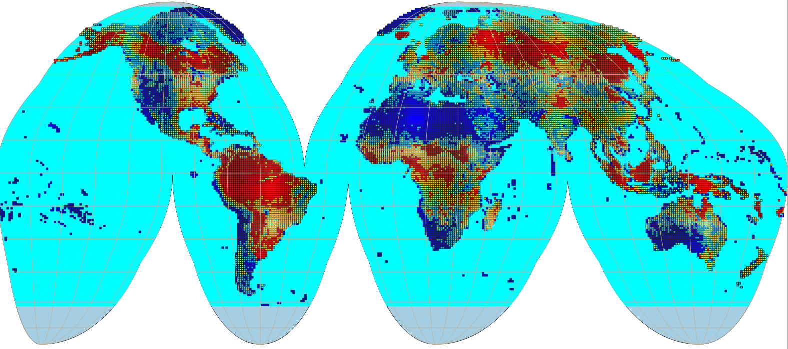

# About 

[{.cover width="250"}](https://openlandmap.org/)

[](https://doi.org/10.5281/zenodo.1476464)

## OpenLandMap project 

```{r, include=FALSE, message=FALSE, results='hide'}
ls <- c("rgdal", "jsonlite", "RCurl", "emo", "stringi")
new.packages <- ls[!(ls %in% installed.packages()[,"Package"])]
if(length(new.packages)) install.packages(new.packages, repos = "https://cloud.r-project.org")
lapply(ls, require, character.only = TRUE)
```

[OpenLandMap](https://openlandmap.org) are Open Land Data services providing access to spatial layers 
covering global land mass (at spatial resolutions of 1 km, 250 m, 100 m, 30 m or finer) hosted by the OpenGeoHub foundation, GILAB.rs and collaborators. 
It aims at becoming an [OpenStreetMap-type system for land data](https://towardsdatascience.com/everybody-has-a-right-to-know-whats-happening-with-the-planet-towards-a-global-commons-5a1ad4ba0bdd). Access to spatial layers is 
possible via interactive visualizations and/or Open Source software solutions. 
Read more about this project [here](https://opengeohub.org/about-openlandmap/).


The OpenLandMap layers, if not specified otherwise, are licensed under the 
[Creative Commons Attribution-ShareAlike 4.0 International license](https://creativecommons.org/licenses/by-sa/4.0/legalcode) (CC BY-SA) and/or
the [Open Data Commons Open Database License](https://opendatacommons.org/licenses/odbl/) (ODbL). This implies that anyone can use, 
or build upon, the OpenLandMap data without restrictions.
See the [Copyright and License](https://opengeohub.org/about-openlandmap/) page for more details.

```{r olm-istria, echo=FALSE, fig.cap="Example of 3D soil information: soil pH visualized at different depths.", out.width="100%"}

```

Users can access OpenLandMap data via the five main channels:

- **OpenLandMap App** at https://openlandmap.org,
- **OpenLandMap training points** at https://github.com/openlandmap/compiled-ess-point-data-sets,
- **OpenGeoHub STAC** installation at https://stac.opengeohub.org,
- [Zenodo.org](https://zenodo.org/search?page=1&size=20&q=OpenLandMap) to access a (version-controlled) back-up copy of data via a DOI,

Data portal https://openlandmap.org is the landing page (running on Geoserver + OpenLayers) where users can browse maps, query values by
location, and find out about most recent news and activities. STAC at https://stac.opengeohub.org 
is a generic layer repository for accessing layers installed and maintained by OpenGeoHub. 
It allow users i.e. producers of layers to edit and update metadata and descriptions, 
create map views, learn how to use WCS, WMS or similar. A copy of the raw data can be obtained 
via zenodo.org or similar public data repositories.

The [training data repository](https://github.com/openlandmap/compiled-ess-point-data-sets) contains 
import and processing steps run to clean up and standardize global compilations of training 
points, most importantly the land cover, vegetation, meteo, soil and similar observations.

## Layers and themes of interest

OpenLandMap.org provides access to global environmental layers focused on land surface. 
We are aiming at serving Analysis-Ready, Cloud-Optimized (ARCO) data which passes [four simple C checks](https://medium.com/mlearning-ai/present-and-future-of-data-cubes-an-european-eo-perspective-735d3f16f7c9) (4C): 
(1) completeness (meaning: data is available for all or at least 99% of pixels of interest), 
(2) consistency (meaning: consistent file names, variable names and relationships, 
and everything is documented via metadata), (3) currency (in this context: the user 
is using the most up-to-date version of the data), (4) correctness (in this context: 
making sure that the served data is the most correct / highest possible quality version). 
In other words, ARCO version of the data should be something that is highest quality, 
fully documented and optimized for web-services / advanced analysis.

Thus, the following five primary requirements need to be satisfied before a layer can be considered for inclusion:

-  Global coverage with at least 98% of the land mask represented in the layer (as not-NA values).
-  An [Open Data license](https://opendefinition.org/licenses/).
-  Metadata is supplied following the format specified below (all columns are filled-in and up-to-date).
-  Sufficient technical documentation is supplied — usually as a scientific paper or a report.
-  A GDAL/proj4-compatible data format and projection system is used that allows for inclusion into Geoserver or similar.

All layers are organized around the following themes 
(based on the [UN-GGIM The Global Fundamental Geospatial Data Themes](https://ggim.un.org/meetings/GGIM-committee/9th-Session/documents/Fundamental_Data_Publication.pdf)):

-  Buildings and Settlements,
-  Elevation and Depth,
-  Geology and Soils,
-  Land Cover and Land Use,
-  Population Distribution,
-  Water,
-  Physical Infrastructure,
-  Climate (_added entry_),
-  Biodiversity and Nature Conservation (_added entry_),

Note some layers maybe match two or more themes and are difficult to classify using a 
simple definition, hence we might mention them at multiple places / within multiple themes.

@RADELOFF2024113918 (the Landsat science team) have proposed 13 essential and 
many more desirable/ aspirational products using medium resolution imagery referred 
to as “Medium-resolution satellite image-based products that meet the identified information needs for sustainable management, societal benefits, and global change challenges”. 
The desirable products include: maps of crop types, irrigated fields, land abandonment, 
forest loss agents, LAI/FAPAR, green vegetation cover fraction, emissivity, ice sheet 
velocity, surface water quality and evaporative stress. The aspirational land monitoring 
products include: forest types, and tree species, urban structure, forest recovery, crop yields, 
forest biomass, habitat heterogeneity and winter habitat indices, net radiation, 
snow and ice sheet surface melt, ice sheet and glacier melt ponds, sea ice motion and 
evaporation and transpiration. This list is largely a basis for OpenLandMap activities for the years to come.

## Accessing data 

OpenLandMap data can be best accessed using the OpenLandMap [S3](https://en.wikipedia.org/wiki/Amazon_S3) file service. 
This service is based on [Cloud-Optimized GeoTIFFs](https://www.cogeo.org/) and is 
probably also the best solution for doing spatial queries and spatial analysis. 

To connect and use data seamlessly in your code, we recommend using STAC tools e.g. 
[RStac](https://cran.r-project.org/web/packages/rstac/) to access the OpenLanMap catalog 
then program analysis by using the most up-to-date version of the data. You 
can use the https://s3.eu-central-1.wasabisys.com/stac/openlandmap/catalog.json and 
the `collection_id` (example: `fapar_essd.lstm`) to access description of data and 
URLs of filenames on S3.

### Accessing data from Zenodo 

To download whole layers from zenodo you can use the R packages jsonlite and RCurl:

```{r}
library(jsonlite)
library(RCurl)
library(rgdal)
```

You first need to authenticate yourself by using a Zenodo API TOKEN 
(see: [how to obtain API TOKEN](http://developers.zenodo.org/#quickstart-upload)):

```{r}
TOKEN = scan("~/TOKEN_ACCESS", what="character")
```

To download the [MODIS LST images at 1 km](https://doi.org/10.5281/zenodo.1420114) you can use the bucket ID `dep.id = "1435938"` which gives:

```{r, eval=FALSE}
dep.id = "1435938"
x = fromJSON(system(paste0('curl -H \"Accept: application/json\" -H \"Authorization: Bearer ', 
        TOKEN, '\" \"https://zenodo.org/api/deposit/depositions/', dep.id, '\"'), intern=TRUE))
  % Total    % Received % Xferd  Average Speed   Time    Time     Time  Current
                                 Dload  Upload   Total   Spent    Left  Speed
100 58704  100 58704    0     0  80219      0 --:--:-- --:--:-- --:--:-- 80196
```


```
  % Total    % Received % Xferd  Average Speed   Time    Time     Time  Current
                                 Dload  Upload   Total   Spent    Left  Speed
100 58704  100 58704    0     0  80219      0 --:--:-- --:--:-- --:--:-- 80196
> str(x, max.level = 1)
List of 15
 $ created     : chr "2018-09-26T18:37:50.432468+00:00"
 $ modified    : chr "2022-04-14T07:11:06.399928+00:00"
 $ id          : int 1435938
 $ conceptrecid: chr "1420114"
 $ doi         : chr "10.5281/zenodo.1435938"
 $ conceptdoi  : chr "10.5281/zenodo.1420114"
 $ doi_url     : chr "https://doi.org/10.5281/zenodo.1435938"
 $ metadata    :List of 15
 $ title       : chr "Long-term MODIS LST day-time and night-time temperatures, sd and differences at 1 km based on the 2000–2017 time series"
 $ links       :List of 21
 $ record_id   : int 1435938
 $ owner       : int 43652
 $ files       :'data.frame':	102 obs. of  5 variables:
 $ state       : chr "done"
 $ submitted   : logi TRUE
```

This shows that there are total of 102 files in this folder. To download all temperatures for August, 
we would hence use:

```
> sel.tif = x$files$links$download[grep("aug", x$files$links$download)]
```

which gives a total of 9 files:

```
> sel.tif
[1] "https://zenodo.org/api/records/1435938/draft/files/clm_lst_mod11a2.aug.day_u.975_1km_s0..0cm_2000..2017_v1.0.tif/content"  
[2] "https://zenodo.org/api/records/1435938/draft/files/clm_lst_mod11a2.aug.day_l.025_1km_s0..0cm_2000..2017_v1.0.tif/content"  
[3] "https://zenodo.org/api/records/1435938/draft/files/clm_lst_mod11a2.aug.day_m_1km_s0..0cm_2000..2017_v1.0.tif/content"      
[4] "https://zenodo.org/api/records/1435938/draft/files/clm_lst_mod11a2.aug.daynight_m_1km_s0..0cm_2000..2017_v1.0.tif/content" 
[5] "https://zenodo.org/api/records/1435938/draft/files/clm_lst_mod11a2.aug.day_sd_1km.png/content"                             
[6] "https://zenodo.org/api/records/1435938/draft/files/clm_lst_mod11a2.aug.day_sd_1km_s0..0cm_2000..2017_v1.0.tif/content"     
[7] "https://zenodo.org/api/records/1435938/draft/files/clm_lst_mod11a2.aug.night_l.025_1km_s0..0cm_2000..2017_v1.0.tif/content"
[8] "https://zenodo.org/api/records/1435938/draft/files/clm_lst_mod11a2.aug.night_u.975_1km_s0..0cm_2000..2017_v1.0.tif/content"
[9] "https://zenodo.org/api/records/1435938/draft/files/clm_lst_mod11a2.aug.night_m_1km_s0..0cm_2000..2017_v1.0.tif/content" 
```

We can test accessing the file by using:

```
tif = stringi::stri_replace_all_fixed(sel.tif[1], c("api/", "draft/", "/content"), "", vectorize_all=FALSE)
> system(paste0("gdalinfo /vsicurl/", tif))
Driver: GTiff/GeoTIFF
Files: /vsicurl/https://zenodo.org/records/1435938/files/clm_lst_mod11a2.aug.day_u.975_1km_s0..0cm_2000..2017_v1.0.tif
Size is 43200, 17924
Coordinate System is:
GEOGCRS["WGS 84",
    DATUM["World Geodetic System 1984",
        ELLIPSOID["WGS 84",6378137,298.257223563,
            LENGTHUNIT["metre",1]]],
    PRIMEM["Greenwich",0,
        ANGLEUNIT["degree",0.0174532925199433]],
    CS[ellipsoidal,2],
        AXIS["geodetic latitude (Lat)",north,
            ORDER[1],
            ANGLEUNIT["degree",0.0174532925199433]],
        AXIS["geodetic longitude (Lon)",east,
            ORDER[2],
            ANGLEUNIT["degree",0.0174532925199433]],
    ID["EPSG",4326]]
Data axis to CRS axis mapping: 2,1
Origin = (-180.000000000000000,87.370000000000005)
Pixel Size = (0.008333333333333,-0.008333333333333)
Metadata:
  AREA_OR_POINT=Area
Image Structure Metadata:
  COMPRESSION=DEFLATE
  INTERLEAVE=BAND
Corner Coordinates:
Upper Left  (-180.0000000,  87.3700000) (180d 0' 0.00"W, 87d22'12.00"N)
Lower Left  (-180.0000000, -61.9966667) (180d 0' 0.00"W, 61d59'48.00"S)
Upper Right ( 180.0000000,  87.3700000) (180d 0' 0.00"E, 87d22'12.00"N)
Lower Right ( 180.0000000, -61.9966667) (180d 0' 0.00"E, 61d59'48.00"S)
Center      (  -0.0000000,  12.6866667) (  0d 0' 0.00"W, 12d41'12.00"N)
Band 1 Block=43200x1 Type=Int16, ColorInterp=Gray
  NoData Value=-32767
  Overviews: 21600x8962, 10800x4481, 5400x2241, 2700x1121, 1350x561, 675x281, 338x141
```

These files can be further downloaded using `download.file(tif, basename(tif))` function or similar.
There is also an R package for Zenodo **[zen4R](https://github.com/eblondel/zen4R)** 
that makes downloading files even easier. In python you can also the library 
**[zen](https://github.com/Open-Earth-Monitor/zen)** that is especially useful 
for uploading very large data sets to Zenodo.

### Accessing data from Google Earth Engine 

[Google Earth Engine users](https://code.earthengine.google.com/?asset=users/opengeohub/openlandmap) can access a snapshot of OpenLandMap.org layers using the following address:

- https://code.earthengine.google.com/?asset=users/opengeohub/openlandmap

Description of layer names and units used can be find [here](GEE/OpenLandMap_layers_for_GEE.pdf).
Note that sync between the layers on the OpenLandMap.org and Google Earth Engine is done 
only once a year, hence, if you wish to use the most up-to-date layers at any moment, 
downloading maps from either Zenodo or via the Wasabi service is recommended.

To access OpenLandMap layers you can also refer to the public data sets at:

- https://developers.google.com/earth-engine/datasets/tags/openlandmap


## The file naming convention 

The OpenLandMap file-naming convention works with 10 fields that basically define the most important properties of the data (this way users can search files, prepare data analysis etc, without even needing to access or open files. The 10 fields include:

1. Generic variable name (needs to be unique): `lclu`
2. Variable procedure combination i.e. method standard (standard abbreviation): `esa.cci`
3. Position in the probability distribution / variable type: `c`
4. Spatial support (usually horizontal block) in m or km: `250m`
5. Depth reference or depth interval e.g. below ("b"), above ("a") ground or at surface ("s") b{depth}{metric length} for certain depth. e.g. b30cm. For the interval we would like to go for b{depth}t{depth}{metric length}: `b30t60cm`
6. Time reference begin time (YYYYMMDD): `20210101`
7. Time reference end time: `20211231`
8. Bounding box (2 letters max): `go` 
9. EPSG code: `epsg.4326`
10. Version code i.e. creation date: `v20221015`

An example of a file-name based on the description above:

```
lclu_esacci.lc.l4_c_250m_s_20210101_20211231_go_epsg.4326_v20221015.tif
```

The following variable types are currently supported:

* `m `= mean value;
* `q.10` = 10% probability quantile (one side probability);
* `d `= median value; equivalent to `q.50`;
* `c `= class or factor / requires a domain with codes / levels;
* `cd` = change class (special cross-domain 2D matrix);
* `p `= probability 0–100%;
* `sse` = Shannon Scaled Entropy index;
* `l.159 `= lower 68% probability threshold (quantile);
* `u.841 `= upper 68% probability threshold (quantile), for one-sided probability use “`q`”,
* `pc `= percent cover of the pixel 0–100%;
* `sd `= standard deviation or prediction error; for multiple standard deviation use e.g. “`sd.2`”
* `md` = model deviation (in the case of ensemble predictions);
* `si `= confidence interval range for the prediction of the mean value;
* `td` = cumulative difference (usually based on time-series of values);

Note that this file naming convention has the following properties:

* Large quantities of files can be easily sorted and searched (one line queries in Bash).
* File-naming patterns can be used to seamlessly build virtual mosaics and composites.  
* Key spatiotemporal properties of the data are available in the file name e.g. variable type, O&M method, spatial resolution, bounding box, projection system, temporal references. Users can program analysis without opening or testing files.
* Versioning system is ubiquitous.
* All file-names are unique.

Geonetwork and STAC will be further used to link the unique file names to: (1) WPs, deliverables, themes / keywords, (2) DOI’s, (3) project homepages, (4) contact pages for support and feedback. For keywords we recommend using the [INSPIRE keywords](https://inspire.ec.europa.eu/glossary). To confirm that metadata is complete and consistent, we recommend using the [INSPIRE metadata validator](https://inspire.ec.europa.eu/validator/home/index.html) and/or [https://data.europa.eu/en](https://data.europa.eu/en) validator.

Some simple additional rules for generating the file name include:

1. Codes and abbreviations should be human-readable as much as possible (hence short, but not too short!);
2. Use only English-US (en-us) language e.g. for months use “jan”, “feb” etc;
3. Consistently use [UNICODE standard](https://unicode.org/standard/standard.html): no non-ASCII characters;
4. Limit the total file name size in characters to: 256;
5. For time reference do not extend beyond hour minute and timezone;
6. For non-standard non-EPSG projections please register your projection first and obtain the code from [Spatial Reference List](https://spatialreference.org/ref/epsg/); 
7. For bounding boxes use as much as possible the 2–letter unique country code; for continents use the Equi7 Grid codes and for global products use “go” for global land without Antarctica, “ga” full global coverage,
8. For method codes use as much as possible unique IDs from [ISO - ICS](https://www.iso.org/standards-catalogue/browse-by-ics.html); 
9. For MODIS products use consistently the MODIS products codes e.g. [MOD11A2 v061](https://lpdaac.usgs.gov/products/mod11a2v061/); 

For long-term aggregates of seasonal, monthly, weekly values use the period name at the end of the method names (#3) for example the long-term estimate of MODIS LST daytime temperature for month August:


```
lst.d_mod11a2v061.aug_m_1km_s_20200101_20211231_go_epsg.4326_v20221015.tif
```

A list of vocabularies to be used as abbreviated names of variables will be provided by OpenGeoHub. The same file-name convention described above can be also used for vector data (this would only have a different file extension) also. 

## The land mask 

The bounding box of interest for OpenLandMap data is:

```
Xmin = -180.00000
Ymin = -62.00081
Xmax = 179.99994
Ymax = 87.37000
```

The image sizes at various standard resolutions are:

-   250m = 172800P x 71698L,
-   500m = 86400P x 35849L,
-   1km = 43200P x 17924L,
                               

```{r mask-word, echo=FALSE, fig.cap="OpenLandMap world land mask: derived using the ESA land cover time series of maps 2000–2015. Red areas indicate barren lands, light green indicates permanent ice areas.", out.width="100%"}
knitr::include_graphics("img/landgis_world_mask.jpg")
```


The standard spatial resolutions are derived using simple
rule of thumb:

-   250 m = 1/480 d.d. = 0.002083333
-   500 m = 1/240 d.d. = 0.004166667
-   1 km = 1/120 d.d. = 0.008333333

OpenLandMap works with a standard land mask derived using the [ESA time series of land cover maps 2000–2015](https://www.esa-landcover-cci.org/?q=node/175):

```
lcv_landmask_esacci.lc.l4_c_250m_s0..0cm_2000..2015_v1.0.tif
```
`r emo::ji("open_file_folder")` [Download layer](https://doi.org/10.5281/zenodo.1476464)

It contains the following values:

-   1 = land (all remaining pixels not permanent water, desert or ice)

-   2 = permanent water bodies (consistently water body 2000–2015)

-   3 = permanent bare areas (consistently bare areas /
      deserts 2000–2015)

-   4 = permanent ice (consistently ice 2000–2015)

If you need a global equal area projection (e.g. to be able to derive total stocks / density of features in N/km-squared) 
we advise using the [Goode Homolosine projection](https://doi.org/10.5281/zenodo.3355006):

```
+proj=igh +ellps=WGS84 +units=m +no_defs
```

```{r igh-world, echo=FALSE, fig.cap="OpenLandMap world mask in Goode Homolosine projection: 100 by 100 km blocks and land mask in the Goode Homolosine projection.", out.width="100%"}

```

`r emo::ji("open_file_folder")` [Download layer](https://doi.org/10.5281/zenodo.3355006)

The bounding box would in this case be:

```
Xmin = -20037508
Ymin = -6728980
Xmax = 20037508
Ymax = 8421750
```

and the corresponding image sizes is:

-   250m = 172800P x 71698L,

## Cloud-optimized GeoTIFF 

All layers included in the OpenLandMap system have been pre-processed following the GDAL's cloud-optimized GeoTIFF
instructions. To process large (global land mask at 250 m resolution or finer) GeoTIFFs please use the following
settings:

```
gdalwarp layer.vrt layer.tif 
   -ot COG
   -tr 0.002083333 0.002083333 
   -te -180.00000 -62.00081 179.99994 87.37000
   -wm 2000 -co \"BIGTIFF=YES\"
```

To prepare a [cloud-optimized GeoTIFF](https://trac.osgeo.org/gdal/wiki/CloudOptimizedGeoTIFF) use:

```
gdaladdo layer.tif -r near 2 4 8 16 32 64 128
gdal_translate layer.tif layer-co.tif -mo \"CO=YES\" -co \"TILED=YES\" -co \"BLOCKXSIZE=512\" 
        -co \"BLOCKYSIZE=512\" -co \"COMPRESS=LZW\" -co \"COPY_SRC_OVERVIEWS=YES\" 
        --config GDAL_TIFF_OVR_BLOCKSIZE 512
```

This will add tiles and optimize compression. `CO=YES` indicates that the GeoTIFF has been cloud-optimized.

The OpenLandMap.org COG's are all available publicly without restrictions via the 
[Wasabi file service](https://gitlab.com/openlandmap/global-layers/-/blob/master/tutorial/OpenLandMap_COG_tutorial.md).

## Contributing data {.unnumbered}

We encourage public and private entities to help this project and share SSL data. 
The following four modes of data sharing are especially encouraged:

1. Open your data by releasing it under Creative Commons ([CC-BY](https://creativecommons.org/licenses/by/4.0/), [CC-BY-SA](https://creativecommons.org/licenses/by-sa/4.0/))  
or Open Data Commons Open Database License ([ODbL](https://opendatacommons.org/licenses/odbl/)). 
This data can then directly imported into the OSSL.  
2. Donate a small part (e.g. 5%) of your data (release under [CC-BY](https://creativecommons.org/licenses/by/4.0/), [CC-BY-SA](https://creativecommons.org/licenses/by-sa/4.0/) and/or [ODbL](https://opendatacommons.org/licenses/odbl/)). 
This data can then directly imported into the OSSL.  
2. Allow openlandmap.org project direct access to your data so that we can run data mining 
and then release ONLY results of data mining under some Open Data license.  
3. Use OpenLandMap data to produce new derivative products, then share them through own 
infrastructures OR contact us for providing hosting support.  

We can sign professional **Data Sharing Agreements** with data producers 
that specify in detail how will the data be used. Our primary interest is in enabling research, 
sharing and use of models (calibration and prediction) and collaboration of groups 
across borders.

We take especial care that your data is secured, encrypted where necessary, 
and kept safely, closely following our [privacy policy and terms of use](https://opengeohub.org/privacy-policy/).

## Contributing documentation {.unnumbered}

Please feel free to contribute technical documentation. See [GitHub
repository](https://github.com/openlandmap/book) for more detailed
instructions.

Information outdated or missing? Please [open an issue](https://github.com/openlandmap/book/issues) or best do a
correction in the text and then make a [pull
request](https://docs.github.com/en/github/collaborating-with-issues-and-pull-requests/creating-a-pull-request).

## Contributors {.unnumbered}

If you've contribute, add also your name and Twitter, ORCID or blog link
below:

[Tomislav Hengl](https://github.com/thengl),
[Leandro L. Parente](https://www.linkedin.com/in/leal-parente/), 
[Rolf Simoes](),

## Disclaimer {.unnumbered}

Whilst utmost care has been taken by the Soil Spectroscopy project and data authors while
collecting and compiling the data, the data is provided _"as is"_. [OpenGeoHub foundation](https://opengeohub.org/about) and its 
suppliers and licensors hereby disclaim all warranties of any kind, express or implied, 
including, without limitation, the warranties of merchantability, fitness for a particular 
purpose and non-infringement. Neither [OpenGeoHub foundation](https://opengeohub.org/about) nor its suppliers and licensors, 
makes any warranty that the Website will be error free or that access thereto will be 
continuous or uninterrupted. You understand that you download from, or otherwise obtain 
content or services through, the Website at your own discretion and risk.

In no event shall the data authors, the OpenLandMap project, or relevant funding
agencies be liable for any actual, incidental or consequential damages arising from use of the data.
By using the OpenLandMap project data, the user expressly acknowledges that the Data
may contain some nonconformities, defects, or errors. No warranty is given that the data will meet
the user's needs or expectations or that all nonconformities, defects, or errors can or will be
corrected. The user should always verify actual data; therefore the user bears all responsibility in
determining whether the data is fit for the user’s intended use.

This document is **under construction**. If you notice an error or outdated information, 
please submit a correction / pull request or **[open an issue](https://github.com/openlandmap/book/issues)**.  

This is a community project. No profits are being made from building and serving 
OpenLandMap. If you would like to become a sponsor of the project, please 
contact us via: <https://opengeohub.org/contact-us/>.  

## How to cite {.unnumbered}

To cite this document please use:

```
@dataset{openlandmap_2023,
  author       = {Hengl, T., Parente, L., Ho, Y.-F. and contributors},
  title        = {{OpenLandMap Open Land Data services}},
  year         = {2023},
  publisher    = {OpenGeoHub foundation},
  address      = {Wageningen},
  version      = {v2},
  doi          = {10.5281/zenodo.1476464},
  url          = {https://doi.org/10.5281/zenodo.1476464}
}
```

## Licence {.unnumbered}

This website/book and attached software is free to use, and is licensed under [the MIT License](https://en.wikipedia.org/wiki/MIT_License). The OpenLandMap data, 
if not otherwise indicated, is available either under the [Creative Commons Attribution 4.0 International CC-BY](https://creativecommons.org/licenses/by/4.0/legalcode) 
and/or [CC-BY-SA](https://creativecommons.org/licenses/by-sa/4.0/legalcode) license / [Open Data Commons Open Database License (ODbL) v1.0](https://opendatacommons.org/licenses/odbl/1-0/).

## Acknowledgments {.unnumbered}

**[EarthMonitor.org](https://EarthMonitor.org/)** project has received funding from the European Union's Horizon Europe research an innovation programme under grant agreement **[No. 101059548](https://cordis.europa.eu/project/id/101059548)**.
